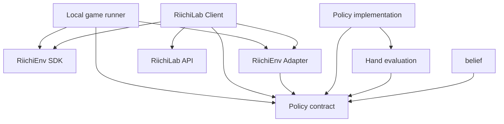

# Architecture

## 目的

lisjongは、同じAI PolicyをRiichiEnvでのローカル対局とRiichiLabでの
オンライン対局から利用できるようにする。外部環境のprotocolや型をPolicyから
分離し、各seatが判断時点で観測可能な情報だけをPolicyへ渡すことを最優先の
境界とする。

lisjong ecosystem全体のrepository責務とrepository間依存方向は、
[`lisjong-project` のArchitecture](https://github.com/lisbun/lisjong-project/blob/main/docs/architecture.md)を正本とする。
本書は、その横断境界の内側にある `lisjong` 固有のPolicy、Adapter、integration architectureを正本として扱う。

本書は、Issue #3のRiichiEnv 0.4.8に対する調査結果、Issue #11の設計、
Issue #20で具体化した共通Policy契約型を受けて、初期段階の責務と依存方向を
定める。Issue #3で確認した公式情報、実測、
推測・未確認事項、設計判断の区別は
[RiichiEnv調査記録](riichienv-investigation.md)を正本とする。

Policyの公開契約は[Policy契約](policy-contract.md)、Policy入力の具体的な許可fieldと
意味契約は[Policy入力の最小スキーマ](policy-input-schema.md)を正本とする。
内部Actionのvariant、field、意味契約は
[内部Actionモデル](internal-action-model.md)、semantic identity、外部候補の集約、
decision-local mappingは[Action identity](action-identity.md)を正本とする。
共通Policy契約型のPython packageは`src/lisjong/policy_contract/`である。

## 責務境界

### Policy

Policyは、環境に依存しない1 seat・1 decision分の`DecisionContext`を受け取り、
選択した`InternalAction`を1件返す判断ロジックである。論理的な公開契約は
`Policy.choose_action(decision)`として表し、詳細は
[Policy契約](policy-contract.md)を正本とする。

- RiichiEnv、RiichiLab、mjai、WebSocket固有の型や通信処理へ依存しない
- `DecisionContext`は、同じseat・同じ判断時点のPolicy入力と
  `legal_actions`をまとめた、整合した不変スナップショットとする
- `legal_actions`は1件以上で、semantic identity上重複せず、
  並び順に契約上の意味を持たない
- pass / noneが合法な場合は明示的な候補とし、空集合を暗黙のpassとしない
- 渡された合法手からだけactionを選択する
- 複数playerをまとめた進行状態を管理せず、渡された1つのseatの判断を
  独立して行う
- Policyの出力へ影響する呼び出し間状態、隠れたPRNG状態、対局やtransportの
  可変状態を所有しない
- 同じ意味内容の`DecisionContext`、同じPolicy実装、model parameter・明示設定、
  宣言済み実行条件に対して、意味的に同じactionを選択する
- 非公開情報、完全な山、他家の手牌、環境内部だけが持つ完全状態を入力として
  要求しない
- `RiichiEnv`の生成、`reset()`、`step()`、`done()`、対局loop、
  通信sessionを所有しない

Policyの返却値は、Local game runnerまたはRiichiLab Clientが利用する共通の
Policy呼び出し境界で`DecisionContext.legal_actions`と照合する。action identity上
ちょうど1件に一致しない場合は、未検証Actionを外部環境へ送信しない。Policy実装
自身へこの検証を重複実装させない。共通境界は
`lisjong.policy_contract.execute_policy(policy, decision)`として実装し、一意に
照合できた`legal_actions`側のcanonicalな`InternalAction`を返す。validation失敗は
`PolicyActionValidationError`とし、Policy自身の例外は変更せず伝播する。

この決定性は最終的なAction選択に対する論理的な再現性であり、内部数値計算の
bit-exactな再現性を要求しない。RiichiEnv constructorや`reset(seed=...)`の
seed挙動もPolicy契約へ持ち込まない。

Policy入力の具体的な許可field、raw event履歴を初期入力へ含めない判断、
不変性、canonicalizationは
[Policy入力の最小スキーマ](policy-input-schema.md)で確定する。内部Actionの
variantとfieldは[内部Actionモデル](internal-action-model.md)で確定する。
action identityの規則は[Action identity](action-identity.md)で確定する。

### RiichiEnv Adapter

RiichiEnv Adapterは、seat別のRiichiEnv外部型とlisjong内部型の間を変換する。

- RiichiEnvの`Observation`と合法な`Action`を、Policyが扱う環境非依存の
  入力と合法手へ変換する
- seat-visibleなObservationとevent deltaを継続的に処理し、Policy入力の生成に
  必要なseat別の現在状態を正規化してmaterializeしてよい
- Policy入力を生成するとき、materialized state、Observation、合法手を
  同じseat・同じdecision時点まで同期する
- Policyが選択した内部actionを、同じseatの
  `Observation.legal_actions()`に含まれるRiichiEnv `Action`へ対応付ける
- 同じsemantic identityへ正規化される複数のphysical Actionを、意味差がないと
  確認できる場合だけPolicy提示前に集約し、decision-local mappingで保持する
- Action要求先のplayer IDとObservation内のplayer IDの整合性を確認する
- seatごとの可視性を維持し、別seatの観測や合法手を混同しない
- Policyの選択結果を外部環境へ返す前に、元の合法手に対して再検証する
- `Observation.to_dict()`やevent履歴を無加工・全量でPolicyへ渡さない
- materialized stateへ他家の非公開情報、完全な山、`env.mjai_log`、Policyの
  過去判断、AI内部memory、transport固有情報を含めない
- 対局loop、環境の生成・初期化、学習アルゴリズム、Policy固有の判断を所有しない
- Policyを呼び出さず、Policy判断の実行順序や複数seatのオーケストレーションを
  所有しない

Adapterの変換・検証はseat単位で行い、単一の「現在手番player」を前提にしない。
Local game runnerまたはRiichiLab Clientが、AdapterとPolicy contractをそれぞれ
利用してPolicy判断を実行し、選択結果をAdapterへ戻して対応付け・再検証する。
Adapter自身はPolicy呼び出しを仲介しない。

materialized stateはPolicyのhidden stateではなく、seat-visibleな外部表現を
現在のPolicy入力へ正規化するための境界側stateである。具体的なPolicy入力は
[Policy入力の最小スキーマ](policy-input-schema.md)で確定する。内部Actionの
variantとfieldは[内部Actionモデル](internal-action-model.md)、semantic
identityと外部候補との対応は[Action identity](action-identity.md)を参照する。

#### `riichienv_adapter` package (Issues #28, #29, and #23)

`src/lisjong/riichienv_adapter/`は、上記責務のうち「seat-visible
materialized stateの同期」と「`PolicyInput`生成」をIssue #28で、RiichiEnv
legal Actionのsemantic変換・集約とdecision-local mappingをIssue #29で実装し、
両者から`DecisionContext`を組み立てる1 decision分の最終接続をIssue #23で
実装したPython packageである。Policy呼び出しとLocal game runnerは対象外である。

- `SeatMaterializedState`は1つのself_seat視点について、
  `Observation.new_events()`から discard順序・tsumogiri・`called_by`、
  riichi段階(NONE/DECLARED/ACCEPTED)、公開済みdora indicator、live wall
  算出用のtsumo event数、kyoku identity(場風・局・本場・親)を同期する
- `build_policy_input()`は、`SeatMaterializedState`と現在の`Observation`を
  同じseat・同じdecision時点まで突き合わせ、一致しない場合は`PolicyInput`を
  生成せず`AdapterSyncError`を送出する
- 公開副露(meld)state自体は独自に追跡せず、`Observation.melds`を毎decision
  直接`PublicMeld`へ変換する。RiichiEnv 0.4.8実測(kakan成立時に既存Pon要素を
  in-place更新し、sequence上の位置も維持する)がこの設計を裏付けている
- RiichiEnvの物理牌ID(0-135)とMJAI牌文字列の両方を、実測に基づき
  `tile_conversion.py`でlisjong `Tile`へ変換する。物理牌IDはOwnHandStateと
  現在meld、MJAI文字列はevent由来の値(discard、dora indicator等)に使う
- `RiichiEnvActionMappingSession`は1 seatだけを所有し、新しいmapping生成ごとに
  Adapter内部generationを進める。旧mappingは未resolveでも失効するため、
  RiichiEnvに架空のdecision IDを追加せずcross-decision利用をfail closedにできる
- `RiichiEnvActionMapping`は11 variantをsemantic identityへ変換・集約し、
  physical fieldから決定したrepresentativeを生成時legal setへ再検証して返す
- `build_decision()`は`SeatMaterializedState`、現在の`Observation`、同じseatの
  `RiichiEnvActionMappingSession`を受け取り、同じObservationから生成した
  `PolicyInput`とsemantic unique candidateで`DecisionContext`を構築し、対応する
  `RiichiEnvActionMapping`と`RiichiEnvDecision`として束ねる。stateとsessionの
  seatは処理前に照合し、別のdecision IDやgenerationは追加しない
- tile変換はIssue #28の`tile_conversion.py`を共用し、Issue #29固有のplayer
  indexから`Seat`への薄い変換だけを`seat_conversion.py`へ分離する
- `policy_contract` / `policies`とは異なり、このpackageは`riichienv`へ
  runtime dependencyとして依存する。依存の逆流はさせない

このpackageは`lisjong.policy_contract`とは別packageであり、後述の
「共通Policy契約package」がRiichiEnv非依存を維持する境界を壊さない。

### Local game runner

`src/lisjong/local_game_runner.py`は、RiichiEnvを使用するローカル対局の
ライフサイクルを管理する実装である。`LocalGameRunner`はone-shotとし、4 seat
すべてのPolicy、`SeatMaterializedState`、`RiichiEnvActionMappingSession`を
seatごとに独立して所有する。

- 再現可能性のためseedをconstructorへ渡して`RiichiEnv`を生成・初期化する
- `reset()`、`step()`、`done()`を呼び出し、対局loopを進行する
- `reset()`または`step()`が返した、Action選択を要求されているplayerから
  seat別`Observation`へのmapを処理する
- 各seatのObservationと合法なRiichiEnv `Action`をRiichiEnv Adapterへ渡し、
  Policy入力と合法な内部action候補へ変換する
- Policy contractを通じて、seatごとに独立したPolicy判断を実行し、共通の
  Policy呼び出し境界で返却値を内部合法手候補へ照合する
- Policyの選択結果をRiichiEnv Adapterへ戻し、同じseatの合法なRiichiEnv
  `Action`へ対応付けて再検証する
- 複数playerへ同時にActionが要求された場合、各seatのObservationと合法手を
  混同せず、検証済みのAction集合を組み立てて`step()`へ返す
- `env.done()`を対局終了判定の正本とし、局情報から独自に終了を推測しない
- 対局終了後のscores、ranks、step数、Policy判断数を`LocalGameResult`で返す
- 任意の`max_steps`へ終了前に到達した場合は、正常結果にせず明示的に失敗する

Local game runnerはRiichiEnv外部型からPolicy内部型への変換やPolicy固有の判断を
所有しない。あるstepで1 seatでもAdapter変換、Policy実行、返却値検証、paired
mappingによるresolveに失敗した場合は、部分的なAction集合やfallbackで
`env.step()`を呼び出さず、元の例外を伝播する。完全対局ログを取得できる場合も、
Policy入力を生成する経路とは分離する。ログの永続化先や評価componentの具体的な
構成は本書では確定しない。

### RiichiLab Client

RiichiLab Clientは、RiichiLabとのオンライン接続とsession lifecycleを担当する。

- 認証、接続、受信、送信、timeout・time budget、ack、終了処理を担当する
- `request_action`を受信し、必要なRiichiEnv SDK機能を使ってserialized
  observationをRiichiEnvの`Observation`として復元する
- serialized Observation、seat-visibleなevent delta、online session内の
  seat別現在状態から、Policy入力の生成に必要なmaterialized stateを維持してよい
- Policy入力を生成するとき、materialized state、復元したObservation、合法手を
  同じseat・同じdecision時点まで同期する
- 復元したObservationと合法なRiichiEnv `Action`をRiichiEnv Adapterへ渡し、
  Policy入力と合法な内部action候補へ変換する
- Policy contractを通じてPolicy判断を実行し、共通のPolicy呼び出し境界で
  返却値を内部合法手候補へ照合する
- Policyの選択結果をRiichiEnv Adapterへ戻し、合法なRiichiEnv `Action`へ
  対応付けて再検証する
- `request_id`と`possible_actions`を管理し、選択結果をオンラインの合法手候補に
  対して送信前に再検証して、MJAI ActionとしてRiichiLabへ返す
- `action_ack`等のprotocol上の応答を処理する
- オンライン対局中に接続が切断された場合は安全に終了し、初期スコープでは
  ゲーム途中からの再接続・復旧を試みない
- tokenをログ、例外、Replay、test fixtureへ含めない
- Policy固有の判断や学習処理を所有しない

RiichiLab Clientが保持してよいmaterialized stateは、Policy入力に必要な
seat-visibleな現在状態の正規化に限る。Policyの過去判断、AI内部memory、
非公開情報を含めず、requestやtransport固有情報をPolicy入力へ混入させない。
具体的なcounter algorithmと同期testは後続実装で確定する。

#### `riichilab_adapter` package (Issue #38)

`src/lisjong/riichilab_adapter/`は、RiichiLab Clientが担う責務のうち、
「parsed済み`request_action`からPolicy判断を経て送信前validation済み
payloadを構築する、1 request x 1 decisionの変換境界」をIssue #38で実装した
Python packageである。WebSocket接続そのもの、token、`start_game` /
`action_ack` / `validation_result` / `end_game`、`request_id`のgame内
lifecycle管理、timeout schedulerは対象外であり、後続Issue #39が扱う。

- `RiichiLabSeatAdapter`は1 game x 1 seatへ明示的にbindされたstateful
  runtimeであり、`SeatMaterializedState`と`RiichiEnvActionMappingSession`を
  requestごとに作り直さず継続保持する
- `process_request_action()`は、parsed済み`request_action`相当dataを受け取り、
  `riichienv.Observation.deserialize_from_base64()`でObservationを復元した
  うえで、既存`riichienv_adapter.build_decision()`と
  `policy_contract.execute_policy()`をそのまま再利用し、paired mappingの
  `resolve()`で得たRiichiEnv Actionから送信可能なMJAI response相当を構築する
- MJAI response構築は`riichienv.Action.to_mjai()`を基底とし、実測で判明した
  欠落field(hora の`pai`、call系/ronの`target`、dahaiの`tsumogiri`)だけを
  resolve済みcanonical `InternalAction`から補う
- 送信直前に、server提示`possible_actions`との送信前semantic validationを
  行う。raw dict完全一致やlist indexに依存せず、送信予定のBot responseと
  各candidateの双方を、公式candidate schemaのsemantic identityへ
  projectionしてから比較する。0件一致・複数件一致(ambiguous)に加えて、
  malformed candidateと未知Action typeのcandidateが1件でも含まれる場合も
  validation全体をfail closedする(forward compatibilityとして許容するのは
  既知typeのunknown追加fieldまで)
- `request_id`はcurrent requestの値をそのままresponseへechoするだけで、
  Adapter内部で生成せず、Policyへも渡さない。`time`は保持のみでPolicy入力へ
  含めない

具体的なnormalization規則、`to_mjai()`実測結果、公式仕様との既知の未確認
事項は[RiichiLab request_action Adapter](riichilab-adapter.md)を正本とする。

#### `riichilab_client` package (Issues #39 / #42)

`src/lisjong/riichilab_client/`は、RiichiLab Clientが担う責務のうち、
「RiichiLab `/ws/validate` / `/ws/ranked`とのWebSocket transport lifecycle(接続、
`start_game` / `request_action` / `action_ack` / `validation_result` /
`end_game`、`request_id`のgame内lifecycle管理)」をIssue #39 / #42で実装した
Python packageである。Policy判断、Observation変換、Action mapping、
`possible_actions` semantic validationは`riichilab_adapter`(#38)を
consumerとして再利用し、この境界へ再実装しない。

- 非公開の共通game session(`session.py`)へ`start_game` bind、request_idの
  monotonic検証、`action_ack` history、#38 Adapter呼び出しを1回だけ実装する。
  `ValidationSession`はseat 0 + `validation_result` terminal、
  `RankedSession`はseat 0..3 + `end_game` terminalだけを差分として持つ
- `Transport` protocolと`WebSocketTransport`(`transport.py`)が、
  実際の`websockets` library接続を最小限のasync `recv`/`send`/`close`へ
  適合させる。`websockets`依存はこのpackage内だけで使用し、
  `policy_contract` / `policies` / `riichienv_adapter`へは逆流させない
- `run_validation(policy, token)`(`validation.py`)が公開APIであり、
  `ValidationResult`(`passed`、`validation_result_received`、
  `end_game_received`、failure reason、request/response件数、
  `action_ack` status historyを保持)を返す。tokenやraw Observation、
  raw `request_action`全文等のsecretは`ValidationResult`へ含めない
- `python -m lisjong.riichilab_client.validation`が、環境変数`BOT_TOKEN`
  からtokenを読み込むlive validation用のCLI entry pointを提供する
- `run_ranked_game(policy, token)`(`ranked.py`)は、ranked endpointへの接続自体を
  queue参加としてjoin payloadを送らず、1 connection / 1 hanchanだけ処理する。
  `end_game`後はdisconnectし、自動requeue・next game・reconnectを行わない
- `RankedGameResult`は自seat、request/response件数、ack history、optionalな
  final scoresを保持する。実ranked serverの`end_game`にscoresがない場合は
  `None`とし、rank / ratingやscore値を推測・補完しない

request_idのmonotonic contract(`+1`連番を仮定しない)、`action_ack`を
「1 request = 1 ack」と仮定しないack status history設計、
client-side deadline cancellationをMVPでは実装しない判断、binary frame
ignoreは両modeで共通である。validationの`end_game`後は
`validation_result`を待ち、rankedの`end_game`後はdisconnectする。詳細は
[RiichiLab WebSocket Client](riichilab-client.md)を正本とする。

途中再接続を将来にわたって禁止するものではない。RiichiLabの仕様と必要性を
確認し、別Issueで合意した場合に限り、初期スコープ外の機能として検討する。
Issues #39 / #42時点ではmid-game reconnectを実装せず、unexpected disconnectは
成功として扱わない。

WebSocket、`request_id`、`possible_actions`、timeout、`action_ack`等の
protocol情報はPolicyへ渡さない。共通のsemantic identity原則は
[Action identity](action-identity.md)を参照する。

### 牌姿評価

牌姿評価は、lisjongの`Tile`から派生的な評価値を計算する環境非依存の層である。
Issue #50時点の責務は向聴数計算だけであり、Policyの判断そのものは所有しない。

- 入力はlisjongの内部型に限り、RiichiEnv、RiichiLab、mjai、WebSocketの型や
  protocolへ依存しない
- Policy実行、合法手判定、対局進行、打牌選択、受け入れ計算、打点評価を
  責務に含めない
- 同じ入力に対して決定的な結果を返し、呼び出し間で状態を持たない
- 具体的な計算backendはpackage内のprivate moduleに隠し、公開契約だけを外へ出す

#### `hand_evaluation` package (Issue #50)

`src/lisjong/hand_evaluation/`は、上記責務のうち向聴数計算をIssue #50で実装した
Python packageである。

- 公開契約は`calculate_shanten(tiles)`だけであり、`Tile`のiterableを受け取って
  向聴数を`int`で返す。和了形が`-1`、聴牌が`0`である
- 入力は純手牌（concealed tiles）のみとし、副露・槓で確定済みのmeldの牌は
  含めない。確定面子数は純手牌枚数から判断するため、`PublicMeld`や`MeldKind`を
  向聴計算へ渡さない
- `OwnHandState`自体は受け取らない。`drawn_tile`は`concealed_tiles`に含まれる
  metadataなので、追加の1枚として数えない
- 内部では赤5と通常5を同じ基礎牌種へ正規化した34牌種countをcanonical
  representationとして使うが、これは公開APIにしない。`Tile`のred distinction
  自体は変更しない
- 不正な入力はfail closedとし、iterableでない入力と`Tile`以外の要素は
  `TypeError`、あり得ない純手牌枚数と基礎牌種5枚以上は`ValueError`とする
- `shanten.py`が公開契約・validation・正規化を、`_python_shanten.py`が34牌種
  countだけを見るprivate backendを担当する。`ShantenBackend` Protocolやplugin
  機構は導入せず、private module境界だけを維持する

初版は正確性と可読性を優先したPython実装であり、lookup table、Rust、C++等の
高速化は実利用後のbenchmarkで必要性が確認されてから検討する。backendを交換
しても`calculate_shanten()`を利用する側の契約は変えない。

### 非公開手牌belief・公開済み牌provenance

非公開手牌beliefは、観測そのものではなく、観測可能情報からAIが構築する
推定stateである。Issue #59時点の責務は、他家手牌を実際に推定する
algorithmではなく、風別beliefのcanonical representationだけである。

Issue #61で、これと対になる**公開済み牌のcanonical exact-count provenance
feature**を追加した。こちらはbeliefではなく、既存semantic state
（discard / meld / dora indicator）から導出する実際に観測された牌の
exact countである。両者は同じ34牌種 / Wind / red-five axisを共有するが、
semantic（推定値かexact観測値か）は明確に区別する。

- 入力はlisjongの内部型（`Tile` / `TileType` / `TileCategory` / `Seat` /
  `Wind` / `OwnHandState` / `PolicyInput`等）に限り、RiichiEnv、RiichiLab、
  mjai、WebSocketの型やprotocolへ依存しない
- baseline / uniform estimator、河・副露・手出し/ツモ切り等を使う他家手牌の
  実際の推定、`PolicyInput` / `DecisionContext`への統合、neural network、
  training datasetは責務に含めない

#### `belief` package (Issue #59)

`src/lisjong/belief/`は、上記責務のうち風別非公開手牌beliefの固定小数点
canonical representationをIssue #59で実装したPython packageである。

- canonical player axisは`Seat`（固定player座席位置）ではなく`Wind`
  （東=0、南=1、西=2、北=3固定）である。EASTは常に現在のdealerを表す。
  `wind_for_seat(seat, dealer_seat)` / `seat_for_wind(wind, dealer_seat)`が
  `RoundState.dealer_seat`から明示的に相互解決する。`Seat`自体・`Wind`自体へ
  相手方identityを埋め込まない
- 34基本牌種は`tile_type_index(tile_type)` / `tile_type_from_index(index)`で
  0..33のcanonical indexへ明示変換する（萬子0-8、筒子9-17、索子18-26、
  字牌27-33）。赤5は`red_five_index(category)`で0=5m、1=5p、2=5sへ変換する。
  いずれも`list(Enum).index(...)`やEnum定義順、dict iteration order、
  hash、object identityには依存しない
- storageはunsigned 16-bit整数、`SCALE = 8192 = 2^13`の固定小数点
  （`raw = round(semantic_value * SCALE)`）とする。expected count
  （0.0..4.0）はraw 0..32768、red-five probability（0.0..1.0）はraw
  0..8192とし、0/1/2/3/4枚と0.0/1.0はquantization errorなしでexactに
  表現する。34牌種側のexpected countは通常5と赤5を合算した値であり、
  red-five probabilityを34牌種側へ追加加算しない
- `HandBelief`は1 windの手牌についてのcanonical belief value型であり、
  `expected_count()` / `red_five_probability()`のsemantic accessorを公開し、
  通常のPolicy/domain codeは`SCALE`等のraw fixed-point表現を直接扱わない。
  boundaryで必要な場合だけ`expected_count_raw` / `red_five_probability_raw`
  のraw fixed-point表現へアクセスする。生成時に、各色について
  `red_five_probability <= 対応する5のexpected_count`をraw integerのexact
  comparisonで検証し、1 raw unitでも超過していれば拒否する（equalは合法）
- `ConcealedHandBelief`は4 windの`HandBelief`を`wind_index`順に束ねる
  containerであり、`flattened_expected_count_raw`（shape `[4, 34]`相当、
  offset = `wind_index * 34 + tile_type_index`） /
  `flattened_red_five_probability_raw`（shape `[4, 3]`相当、offset =
  `wind_index * 3 + red_five_index`）でWind-major / row-majorのflattened
  raw bufferを公開する。将来のRust/C++側`[[u16; 34]; 4]`相当表現と自然に
  対応する
- `exact_self_belief(own_hand_state)`は既存`OwnHandState`から自手の
  exact beliefを生成する。`drawn_tile`は`concealed_tiles`内のmetadataとして
  扱い追加の1枚として数えず、`concealed_tiles`内の各Tileを1回ずつ数える。
  `OwnHandState`自体が13/14枚固定や非空制約を持たないため、このfactoryも
  独自にそれらの制約を追加しない
- Tile identityと同様、physical copy identity（同じ基礎牌種・赤牌区分の
  牌が何枚目のcopyか）は持たない
- production dependencyへNumPyは追加せず、Python標準libraryだけで実装する
- canonical byte buffer APIはIssue #59では公開せず、将来公開する場合は
  `uint16` little-endianへ固定する

`belief`パッケージが生成するvalue objectは、このIssueでは`PolicyInput`や
`DecisionContext`へ統合しない。統合、実際の推定algorithm、neural network、
training datasetは後続Issueで扱う。

#### 公開済み牌provenance (Issue #61)

`src/lisjong/belief/public_provenance.py`は、既存semantic state
（`PlayerPublicState.discards` / `PlayerPublicState.melds`、
`RoundState.dora_indicators`）から、公開済み牌のcanonical exact-count
provenance featureをIssue #61で実装したmoduleである。

- 既存semantic stateを唯一の正本とし、`encode_public_tile_provenance(policy_input)`
  が`PolicyInput`全体から毎回full recomputationするpure / deterministicな
  encoderである。numeric featureを第二のmutable game stateとして持たず、
  incremental update、cache、dirty flagは実装しない
- `TileProvenanceCounts`（34牌種`tile_counts` + red-five companion
  `red_five_counts`）と、それを`wind_index`順に束ねる
  `WindTileProvenanceCounts`が、discardとmeld hand-originそれぞれの
  `[4, 34]` + `[4, 3]`を表す。dora indicatorは1 windに属さないため
  `TileProvenanceCounts`単体（`[34]` + `[3]`）で表す
- `PublicTileProvenance`が`discards` / `meld_hand_origin` / `dora_indicators`を
  束ねる。`players`のiteration indexをcanonical Wind orderとみなさず、
  `RoundState.dealer_seat`と`wind_for_seat()`で各seatの自風を明示的に
  解決してから集計する
- `discard_counts`は鳴かれた牌も除外せず、捨てたplayerのprovenanceとして
  数える。`meld_hand_origin_counts`は、meld ownerの手牌に由来すると確定
  している構成牌だけを数える。`PublicMeld.tiles`という同じ`TileType` +
  `is_red`なら同値なsemantic multisetから、`called_tile`を
  `list.remove()`相当で**exactly one occurrenceだけ**減算し、`tile !=
  called_tile`のようなvalue filterで同値牌をすべて除外しない。ANKANは
  4枚すべて、CHI/PONは2枚、DAIMINKAN/KAKANは3枚がowner hand-originとなる。
  called tileはdiscard側とmeld側で二重countしない
- `TileProvenanceCounts.__post_init__`が、基本牌種count 0..4、赤5 count
  0..1、および各色`red_five_counts <= 対応する5のtile_counts`を
  feature内で局所的に検証してfail closedする。discard + meld + dora +
  concealed間の牌保存則はこのIssueの対象外である
- exact countはHandBeliefの`expected_count` / `red_five_probability`
  （推定値）とsemanticを混同しない。`exact_count * SCALE`でIssue #59の
  fixed-point domainへlosslessに変換できる

`public_provenance.py`は`canonical_axes.py`のWind / 34牌種 / red-five
mappingをそのまま再利用し、別実装として複製しない。`Discard` /
`PublicMeld`が持つ順序・手出しツモ切り・鳴き種別等のsemantic structureは
置き換えず、event-levelなdiscard↔meld対応の再検証もこのmoduleでは行わない
（Adapter境界がすでに保証するsemantic stateを正本として扱う）。

## 依存方向

次の図では、矢印の始点が終点の公開契約または外部APIを利用する。



Local game runnerとRiichiLab Clientは、それぞれローカル対局とオンライン対局の
オーケストレーションを担当する。両者はRiichiEnv AdapterとPolicy contractを
直接利用し、Adapterによる変換・検証の前後でPolicy判断を呼び出す。

AdapterからPolicy contractへの矢印は、Policy入力や内部action等の共通契約へ
依存し得ることを表し、AdapterがPolicyを呼び出す経路を表すものではない。
Policy implementationはPolicy contractを実装する。

Policy contractとPolicy implementationはRiichiEnv SDK、RiichiLab API、
mjai、WebSocketへ依存しない。外部環境の仕様変更はLocal game runner、
RiichiEnv Adapter、またはRiichiLab Clientで吸収し、Policyへ直接伝播させない。

Hand evaluationはPolicy contractのvalue型だけへ依存し、Policy implementationが
Hand evaluationを利用する。依存方向は次のとおりで、逆流させない。

```text
policy_contract
      ↑
hand_evaluation
      ↑
policies
```

Hand evaluationはPolicyを呼び出さず、AdapterやRunner / Clientからも参照
されない。RiichiEnv AdapterやRiichiLab Clientが牌姿評価へ依存する経路は
作らない。

`belief`パッケージも同様にPolicy contractのvalue型だけへ依存し、Policy
contract側からは依存されない。Issue #59時点では`PolicyInput` /
`DecisionContext`、Policy implementation、Adapter、Runner / Clientのいずれも
`belief`を参照しない。

### 共通Policy契約package

`lisjong.policy_contract`は、Policy実装、RiichiEnv Adapter、Local game runner、
RiichiLab Clientが共有する環境非依存の契約packageである。package rootから
`Policy`、`DecisionContext`、`PolicyInput`、`InternalAction`各variant、および
それらを構成するvalue型に加え、`execute_policy()`と
`PolicyActionValidationError`を公開する。

- `policy.py`は最小のstructural `Policy(Protocol)`を定義する
- `policy_execution.py`は1 seat × 1 decisionのPolicy呼び出しと返却値の
  runtime validationを担い、semantic identity上一意に一致した合法候補を返す
- `decision_context.py`と`policy_input.py`は1 decision分の入力境界を定義する
- `action.py`は11個の独立したfrozen dataclassと、そのunionである
  `InternalAction`を定義する
- seat、wind、tile、discard、meld、riichiの基本value型は同名のmodule、局・player・
  自席手牌stateは`round_state.py`、`player_state.py`、`own_hand_state.py`へ分離する

このpackageはPython標準libraryとpackage内の型だけへ依存し、RiichiEnv、
RiichiLab、mjai、WebSocketその他の外部protocol固有型をimportしない。Policy実装と
Adapterはこのpackageへ依存し、Runner / ClientはAdapterとこのpackageを利用する。
逆向きの依存は作らない。

## 情報境界

Policyへ渡してよい情報は、そのseatのプレイヤーが判断時点で観測できる情報に
限る。

- 自席の手牌と、そのseatから見えるツモ牌
- 公開済みの牌、副露、宣言、点数、局情報
- 判断時点で利用可能な、そのseatの合法手
- 公開ルールと対局進行上必要な公開状態

Issue #3のRiichiEnv 0.4.8に対する実測では、`env.mjai_log`の
`start_kyoku`に全playerの実配牌が、通常進行中の`tsumo`に他家を含む
実ツモ牌が記録されていた。一方、seat別`Observation.new_events()`では、
他家の配牌とツモ牌が`?`へmaskされていた。

この実測を踏まえ、次の境界を固定する。

- `env.mjai_log`は全playerの非公開情報を含み得る完全対局ログとして扱い、
  Policy入力には使用しない
- 完全対局ログはReplay、調査、監査、記録、評価等のPolicy外用途に限定する
- seat別Policy入力はRiichiEnv Adapterが、そのseatから観測可能と確認した
  情報だけを明示的に選んで生成する
- `Observation.to_dict()`を無加工でPolicyへ渡さない
- seat別eventであっても履歴を自動的に全量入力しない
- 完全対局ログを保持する責務と、seat別Policy入力を生成する責務を分離する
- AdapterとClientの変換testでは、値の対応だけでなく禁止情報が欠落している
  ことも確認する
- 固定rulesetは各`DecisionContext`へ複製せず、明示的で不変なPolicy
  configurationとしてPolicy instanceへbindする

他家の未公開牌、山の並び、将来のevent、環境内部だけが持つ完全状態は
Policyへ渡さない。Issue #3で確認したseat別eventのmaskだけから
`Observation`の全fieldが安全であるとは一般化しない。Policy入力へ採用する
具体的な許可field、materialized state、raw event履歴を初期入力へ含めない判断は
[Policy入力の最小スキーマ](policy-input-schema.md)を参照する。

## 確定事項と未決定事項

本書の責務分離は、Issue #3の実測からlisjongへ引き継ぐ設計判断と、
Issue #11ですでに前提とした方針である。

Policy公開契約では、`Policy`、`choose_action`、`DecisionContext`、
`InternalAction`を一貫して使用する。これらは`lisjong.policy_contract`で
Python型として実装済みである。

Policy入力の具体的な許可field、意味契約、不変性、canonicalization、固定rulesetの
bind方針、初期入力へ含めない情報は
[Policy入力の最小スキーマ](policy-input-schema.md)で確定済みである。
内部Actionのvariant、field、麻雀上の意味、Actionと結果stateの分離は
[内部Actionモデル](internal-action-model.md)で確定済みである。
semantic identity、multiset canonicalization、外部候補のsemantic aggregation、
decision-local mapping、deterministic representative、revalidationの原則は
[Action identity](action-identity.md)で確定済みである。Action identityは11個の
frozen dataclassのvalue equalityとして実装し、順序なしmultiset fieldは生成時に
canonical tupleへ正規化する。別のaction IDやcanonical keyは導入しない。

RiichiLab外部候補のdeterministic representativeの具体的なtie-break key、
RiichiLab側decision-local mappingの実装構造、Policy評価のtimeout処理は、
各componentの後続実装Issueで決定する。共通Policy実行境界のvalidation失敗は
`PolicyActionValidationError`、Policy自身の例外は変更せず伝播することで確定した。

RiichiEnvで未実測のAction種別、`Observation`の未確認field、実際の
RiichiLab WebSocket requestとのaction照合等は、確認済みの実測として扱わない。
詳細はRiichiEnv調査記録の「推測・未確認事項」と「実測後に確定する判断」を
参照する。

## データと秘密情報

model weight、raw牌譜、実験生成物、tokenはsource codeと分離する。外部データや
modelを利用する場合は、提供元、license、version、取得方法、hashを記録する。
秘密情報は環境変数等から実行時に注入し、repositoryへcommitしない。

## 現在の非目標

- 具体Policyの戦略改善
- RiichiLab rankedの継続運用、rating改善、reconnect、auto requeue、
  multi-connection
- AIの学習・推論と強さの評価
- Mortalまたはpython-studyとの統合
- 3人麻雀対応
- Rustによる最適化
- modelや牌譜の取得・配布
