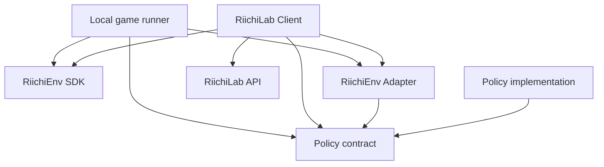

# Architecture

## 目的

lisjongは、同じAI PolicyをRiichiEnvでのローカル対局とRiichiLabでの
オンライン対局から利用できるようにする。外部環境のprotocolや型をPolicyから
分離し、各seatが判断時点で観測可能な情報だけをPolicyへ渡すことを最優先の
境界とする。

本書は、Issue #3のRiichiEnv 0.4.8に対する調査結果とIssue #11の前提を受けて、
初期段階の責務と依存方向を定める。Issue #3で確認した公式情報、実測、
推測・未確認事項、設計判断の区別は
[RiichiEnv調査記録](riichienv-investigation.md)を正本とする。

Policyの公開契約は[Policy契約](policy-contract.md)、Policy入力の具体的な許可fieldと
意味契約は[Policy入力の最小スキーマ](policy-input-schema.md)を正本とする。
内部Actionのvariant、field、意味契約は
[内部Actionモデル](internal-action-model.md)、semantic identity、外部候補の集約、
decision-local mappingは[Action identity](action-identity.md)を正本とする。
Pythonのpackage構成は、引き続きIssue #11の後続項目で設計する。

## 責務境界

### Policy

Policyは、環境に依存しない1 seat・1 decision分の`DecisionContext`を受け取り、
選択した`InternalAction`を1件返す判断ロジックである。論理的な公開契約は
`Policy.choose_action(decision)`として表し、詳細は
[Policy契約](policy-contract.md)を正本とする。

- RiichiEnv、RiichiLab、mjai、WebSocket固有の型や通信処理へ依存しない
- `DecisionContext`は、同じseat・同じ判断時点のPolicy入力と
  `legal_actions`をまとめた、整合した不変スナップショットとする
- `legal_actions`は1件以上で、semantic identity上重複せず、
  並び順に契約上の意味を持たない
- pass / noneが合法な場合は明示的な候補とし、空集合を暗黙のpassとしない
- 渡された合法手からだけactionを選択する
- 複数playerをまとめた進行状態を管理せず、渡された1つのseatの判断を
  独立して行う
- Policyの出力へ影響する呼び出し間状態、隠れたPRNG状態、対局やtransportの
  可変状態を所有しない
- 同じ意味内容の`DecisionContext`、同じPolicy実装、model parameter・明示設定、
  宣言済み実行条件に対して、意味的に同じactionを選択する
- 非公開情報、完全な山、他家の手牌、環境内部だけが持つ完全状態を入力として
  要求しない
- `RiichiEnv`の生成、`reset()`、`step()`、`done()`、対局loop、
  通信sessionを所有しない

Policyの返却値は、Local game runnerまたはRiichiLab Clientが利用する共通の
Policy呼び出し境界で`DecisionContext.legal_actions`と照合する。action identity上
ちょうど1件に一致しない場合は、未検証Actionを外部環境へ送信しない。Policy実装
自身へこの検証を重複実装させない。

この決定性は最終的なAction選択に対する論理的な再現性であり、内部数値計算の
bit-exactな再現性を要求しない。RiichiEnv constructorや`reset(seed=...)`の
seed挙動もPolicy契約へ持ち込まない。

Policy入力の具体的な許可field、raw event履歴を初期入力へ含めない判断、
不変性、canonicalizationは
[Policy入力の最小スキーマ](policy-input-schema.md)で確定する。内部Actionの
variantとfieldは[内部Actionモデル](internal-action-model.md)で確定する。
action identityの規則は[Action identity](action-identity.md)で確定する。

### RiichiEnv Adapter

RiichiEnv Adapterは、seat別のRiichiEnv外部型とlisjong内部型の間を変換する。

- RiichiEnvの`Observation`と合法な`Action`を、Policyが扱う環境非依存の
  入力と合法手へ変換する
- seat-visibleなObservationとevent deltaを継続的に処理し、Policy入力の生成に
  必要なseat別の現在状態を正規化してmaterializeしてよい
- Policy入力を生成するとき、materialized state、Observation、合法手を
  同じseat・同じdecision時点まで同期する
- Policyが選択した内部actionを、同じseatの
  `Observation.legal_actions()`に含まれるRiichiEnv `Action`へ対応付ける
- 同じsemantic identityへ正規化される複数のphysical Actionを、意味差がないと
  確認できる場合だけPolicy提示前に集約し、decision-local mappingで保持する
- Action要求先のplayer IDとObservation内のplayer IDの整合性を確認する
- seatごとの可視性を維持し、別seatの観測や合法手を混同しない
- Policyの選択結果を外部環境へ返す前に、元の合法手に対して再検証する
- `Observation.to_dict()`やevent履歴を無加工・全量でPolicyへ渡さない
- materialized stateへ他家の非公開情報、完全な山、`env.mjai_log`、Policyの
  過去判断、AI内部memory、transport固有情報を含めない
- 対局loop、環境の生成・初期化、学習アルゴリズム、Policy固有の判断を所有しない
- Policyを呼び出さず、Policy判断の実行順序や複数seatのオーケストレーションを
  所有しない

Adapterの変換・検証はseat単位で行い、単一の「現在手番player」を前提にしない。
Local game runnerまたはRiichiLab Clientが、AdapterとPolicy contractをそれぞれ
利用してPolicy判断を実行し、選択結果をAdapterへ戻して対応付け・再検証する。
Adapter自身はPolicy呼び出しを仲介しない。

materialized stateはPolicyのhidden stateではなく、seat-visibleな外部表現を
現在のPolicy入力へ正規化するための境界側stateである。具体的なPolicy入力は
[Policy入力の最小スキーマ](policy-input-schema.md)で確定する。状態更新と同期の
機械的な検証方法は後続で確定する。内部Actionのvariantとfieldは
[内部Actionモデル](internal-action-model.md)、semantic identityと外部候補との
対応は[Action identity](action-identity.md)を参照する。

### Local game runner

Local game runnerは、RiichiEnvを使用するローカル対局のライフサイクルを
管理する。

- `RiichiEnv`を生成・初期化する
- `reset()`、`step()`、`done()`を呼び出し、対局loopを進行する
- `reset()`または`step()`が返した、Action選択を要求されているplayerから
  seat別`Observation`へのmapを処理する
- 各seatのObservationと合法なRiichiEnv `Action`をRiichiEnv Adapterへ渡し、
  Policy入力と合法な内部action候補へ変換する
- Policy contractを通じて、seatごとに独立したPolicy判断を実行し、共通の
  Policy呼び出し境界で返却値を内部合法手候補へ照合する
- Policyの選択結果をRiichiEnv Adapterへ戻し、同じseatの合法なRiichiEnv
  `Action`へ対応付けて再検証する
- 複数playerへ同時にActionが要求された場合、各seatのObservationと合法手を
  混同せず、検証済みのAction集合を組み立てて`step()`へ返す
- `env.done()`を対局終了判定の正本とし、局情報から独自に終了を推測しない
- 対局終了後のscores、ranks等の結果を取得する
- 必要に応じて完全対局ログを記録・評価等のPolicy外用途へ渡す

Local game runnerはRiichiEnv外部型からPolicy内部型への変換やPolicy固有の判断を
所有しない。完全対局ログを取得できる場合も、Policy入力を生成する経路とは
分離する。ログの永続化先や評価componentの具体的な構成は本書では確定しない。

### RiichiLab Client

RiichiLab Clientは、RiichiLabとのオンライン接続とsession lifecycleを担当する。

- 認証、接続、受信、送信、timeout・time budget、ack、終了処理を担当する
- `request_action`を受信し、必要なRiichiEnv SDK機能を使ってserialized
  observationをRiichiEnvの`Observation`として復元する
- serialized Observation、seat-visibleなevent delta、online session内の
  seat別現在状態から、Policy入力の生成に必要なmaterialized stateを維持してよい
- Policy入力を生成するとき、materialized state、復元したObservation、合法手を
  同じseat・同じdecision時点まで同期する
- 復元したObservationと合法なRiichiEnv `Action`をRiichiEnv Adapterへ渡し、
  Policy入力と合法な内部action候補へ変換する
- Policy contractを通じてPolicy判断を実行し、共通のPolicy呼び出し境界で
  返却値を内部合法手候補へ照合する
- Policyの選択結果をRiichiEnv Adapterへ戻し、合法なRiichiEnv `Action`へ
  対応付けて再検証する
- `request_id`と`possible_actions`を管理し、選択結果をオンラインの合法手候補に
  対して送信前に再検証して、MJAI ActionとしてRiichiLabへ返す
- `action_ack`等のprotocol上の応答を処理する
- オンライン対局中に接続が切断された場合は安全に終了し、初期スコープでは
  ゲーム途中からの再接続・復旧を試みない
- tokenをログ、例外、Replay、test fixtureへ含めない
- Policy固有の判断や学習処理を所有しない

RiichiLab Clientが保持してよいmaterialized stateは、Policy入力に必要な
seat-visibleな現在状態の正規化に限る。Policyの過去判断、AI内部memory、
非公開情報を含めず、requestやtransport固有情報をPolicy入力へ混入させない。
具体的なcounter algorithmと同期testは後続実装で確定する。

途中再接続を将来にわたって禁止するものではない。RiichiLabの仕様と必要性を
確認し、別Issueで合意した場合に限り、初期スコープ外の機能として検討する。

WebSocket、`request_id`、`possible_actions`、timeout、`action_ack`等の
protocol情報はPolicyへ渡さない。受信・送信messageの詳細な変換方法と
RiichiLab固有の照合規則は後続のRiichiLab Client実装Issueで確定する。共通の
semantic identity原則は[Action identity](action-identity.md)を参照する。

## 依存方向

次の図では、矢印の始点が終点の公開契約または外部APIを利用する。

Local game runnerとRiichiLab Clientは、それぞれローカル対局とオンライン対局の
オーケストレーションを担当する。両者はRiichiEnv AdapterとPolicy contractを
直接利用し、Adapterによる変換・検証の前後でPolicy判断を呼び出す。

AdapterからPolicy contractへの矢印は、Policy入力や内部action等の共通契約へ
依存し得ることを表し、AdapterがPolicyを呼び出す経路を表すものではない。
Policy implementationはPolicy contractを実装する。

Policy contractとPolicy implementationはRiichiEnv SDK、RiichiLab API、
mjai、WebSocketへ依存しない。外部環境の仕様変更はLocal game runner、
RiichiEnv Adapter、またはRiichiLab Clientで吸収し、Policyへ直接伝播させない。

## 情報境界

Policyへ渡してよい情報は、そのseatのプレイヤーが判断時点で観測できる情報に
限る。

- 自席の手牌と、そのseatから見えるツモ牌
- 公開済みの牌、副露、宣言、点数、局情報
- 判断時点で利用可能な、そのseatの合法手
- 公開ルールと対局進行上必要な公開状態

Issue #3のRiichiEnv 0.4.8に対する実測では、`env.mjai_log`の
`start_kyoku`に全playerの実配牌が、通常進行中の`tsumo`に他家を含む
実ツモ牌が記録されていた。一方、seat別`Observation.new_events()`では、
他家の配牌とツモ牌が`?`へmaskされていた。

この実測を踏まえ、次の境界を固定する。

- `env.mjai_log`は全playerの非公開情報を含み得る完全対局ログとして扱い、
  Policy入力には使用しない
- 完全対局ログはReplay、調査、監査、記録、評価等のPolicy外用途に限定する
- seat別Policy入力はRiichiEnv Adapterが、そのseatから観測可能と確認した
  情報だけを明示的に選んで生成する
- `Observation.to_dict()`を無加工でPolicyへ渡さない
- seat別eventであっても履歴を自動的に全量入力しない
- 完全対局ログを保持する責務と、seat別Policy入力を生成する責務を分離する
- AdapterとClientの変換testでは、値の対応だけでなく禁止情報が欠落している
  ことも確認する
- 固定rulesetは各`DecisionContext`へ複製せず、明示的で不変なPolicy
  configurationとしてPolicy instanceへbindする

他家の未公開牌、山の並び、将来のevent、環境内部だけが持つ完全状態は
Policyへ渡さない。Issue #3で確認したseat別eventのmaskだけから
`Observation`の全fieldが安全であるとは一般化しない。Policy入力へ採用する
具体的な許可field、materialized state、raw event履歴を初期入力へ含めない判断は
[Policy入力の最小スキーマ](policy-input-schema.md)を参照する。

## 確定事項と未決定事項

本書の責務分離は、Issue #3の実測からlisjongへ引き継ぐ設計判断と、
Issue #11ですでに前提とした方針である。

Policy公開契約では、`Policy`、`choose_action`、`DecisionContext`、
`InternalAction`を設計上の用語として一貫して使用する。具体的なPython宣言は
実装時に契約を損なわない形で定義する。

Policy入力の具体的な許可field、意味契約、不変性、canonicalization、固定rulesetの
bind方針、初期入力へ含めない情報は
[Policy入力の最小スキーマ](policy-input-schema.md)で確定済みである。
内部Actionのvariant、field、麻雀上の意味、Actionと結果stateの分離は
[内部Actionモデル](internal-action-model.md)で確定済みである。
semantic identity、multiset canonicalization、外部候補のsemantic aggregation、
decision-local mapping、deterministic representative、revalidationの原則は
[Action identity](action-identity.md)で確定済みである。

次はIssue #11の後続項目で決定するため、本書では確定しない。

- Pythonでの具体的なaction equality、hash、canonical key表現
- 外部環境ごとのdeterministic representativeの具体的なtie-break key
- 設計用語を表す具体的なPython型の実装方式
- Python package、module、classの構成

RiichiEnvで未実測のAction種別、`Observation`の未確認field、実際の
RiichiLab WebSocket requestとのaction照合等は、確認済みの実測として扱わない。
詳細はRiichiEnv調査記録の「推測・未確認事項」と「実測後に確定する判断」を
参照する。

## データと秘密情報

model weight、raw牌譜、実験生成物、tokenはsource codeと分離する。外部データや
modelを利用する場合は、提供元、license、version、取得方法、hashを記録する。
秘密情報は環境変数等から実行時に注入し、repositoryへcommitしない。

## 現在の非目標

- action identity、Adapter、Clientの具体的なPython実装
- Policy、Adapter、Local game runner、RiichiLab Clientの本実装
- AIの学習・推論と強さの評価
- Mortalまたはpython-studyとの統合
- 3人麻雀対応
- Rustによる最適化
- modelや牌譜の取得・配布
