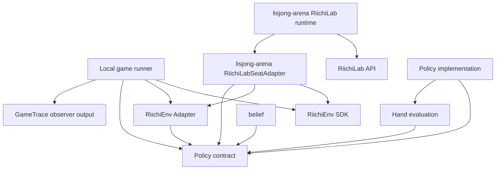

# Architecture

## 目的

lisjongは、同じAI PolicyをRiichiEnvでのローカル対局とRiichiLabでの
オンライン対局から利用できるようにする。外部環境のprotocolや型をPolicyから
分離し、各seatが判断時点で観測可能な情報だけをPolicyへ渡すことを最優先の
境界とする。

lisjong ecosystem全体のrepository責務とrepository間依存方向は、
[`lisjong-project` のArchitecture](https://github.com/lisbun/lisjong-project/blob/main/docs/architecture.md)を正本とする。
本書は、その横断境界の内側にある`lisjong`固有のPolicy、AI-side contract、牌効率・belief・value / risk等のAI decision core architectureを正本として扱う。external execution / observationのcurrent contractはcanonical ownerである`lisjong-arena`側を正本とする。

本書は、Issue #3のRiichiEnv 0.4.8に対する調査結果、Issue #11の設計、
Issue #20で具体化した共通Policy契約型を受けて、初期段階の責務と依存方向を
定める。Issue #3で確認した公式情報、実測、
推測・未確認事項、設計判断の区別は
[RiichiEnv調査記録](riichienv-investigation.md)を正本とする。

Policyの公開契約は[Policy契約](policy-contract.md)、Policy入力の具体的な許可fieldと
意味契約は[Policy入力の最小スキーマ](policy-input-schema.md)を正本とする。
内部Actionのvariant、field、意味契約は
[内部Actionモデル](internal-action-model.md)、semantic identity、外部候補の集約、
decision-local mappingは[Action identity](action-identity.md)を正本とする。
共通Policy契約型のPython packageは`src/lisjong/policy_contract/`である。

## Long-term AI architecture

lisjongは、不完全情報ゲームであるリーチ麻雀において、観測可能な情報から
hidden stateに対するbeliefを構築し、その不確実性とstructural / value evaluationを
組み合わせて意思決定へ活用するAIを長期的に目指す。

概念的な責務境界は次のように捉える。この図は特定のclassやruntime call graphを
固定するものではなく、推論・評価・意思決定を独立に改善可能にするための境界を
示す。

```text
observable information
        ↓
canonical observable state
        ↓
physical accounting
        ↓
hidden-state inference / belief
        │
        ├──────────────┐
        │              │
        ▼              ▼
structural        score / risk /
evaluation        value estimation
        │              │
        └──────┬───────┘
               ▼
        Policy / decision
```

hidden-information inferenceの中では、**各他家のconcealed handに各牌種が何枚
存在するかの期待値を高精度に推定すること**を主要な研究・開発テーマとする。
将来的に既存手法と定量比較可能な評価基盤を整備したうえで、最高水準の推定能力を
目標とする。ただし、未検証の性能を現在すでに達成済みであるとは主張しない。

現在の`HandBelief` / `ConcealedHandBelief`、34牌種 + red-five companion、
fixed-point `SCALE`、Wind-major layout、conditional-uniform estimator等は、
このvisionを実現するための**現在のcontract / baseline**であり、long-term vision
そのものではない。将来joint distribution、追加belief target、observation-aware
heuristic、statistical / learned estimator、learned latent representation等へ
発展しても、この上位境界を維持できる抽象度を保つ。

estimatorは概念的に次の順序で高度化できる。

```text
Exact observable knowledge
        +
Conditional-uniform baseline
        ↓
Observation-aware heuristic estimator
        ↓
Statistical / learned estimator
        ↓
Higher-accuracy calibrated inference
```

どのfeature、algorithm、model architectureを使うかは個別Issueで決定する。
河、副露、立直、巡目、手出し / ツモ切り、ドラ表示牌、自手等の合法的に観測可能な
情報は将来のestimator input候補となるが、実対局時のonline inferenceへ他家の
実手牌、完全な山等のhidden ground truthを入力しない。

一方、offline component evaluationではpredictionとhidden ground truthを比較して
accuracy / calibration等を定量評価できる。runtime推論経路とoffline evaluatorを
分離し、評価目的で利用できるground truthをPolicy inputへ逆流させない。

beliefをcanonicalなAI-side stateとして受け入れる境界では、麻雀牌のphysical
inventoryと整合する必要がある。learned estimator内部へ特定の保存則実装方式を
強制するのではなく、model output後のvalidation / projection等も許容しつつ、
物理的に不可能なbeliefを黙って正常値として扱わない。具体的な保存則、fixed-point
validation、representation contractは後述の現在の`belief` packageを正本とする。

inference quality、decision quality、game performanceは別の主張として扱う。

```text
Inference quality
    -> component-specific accuracy / calibration

Decision quality
    -> belief / valueから選択するActionのquality

Game performance
    -> controlled game / match result
```

HandBelief等のcomponent-specific correctness / accuracy / calibrationは`lisjong`側を
正本とし、Policyへ統合した後のcontrolled performance comparisonは
`lisjong-arena`へ接続する。推定精度の向上を、そのままPolicyや最終対局成績の向上と
同一視しない。

将来的にはhidden-state beliefを向聴・受け入れ・lookahead等のstructural evaluation、
打点・放銃risk・局収支等のvalue estimationと統合し、立直、鳴き、押し引き、
score-aware decision等へ接続する。Expected valueは中心的な候補だが、順位価値、
ラス回避、トップ取り等のgame-level objectiveを含むutility-aware decisionを許容し、
単一の局収支EVをlong-termな最終目的関数として固定しない。

成熟したOSSのreference / backend / benchmark / tooling利用、十分に独立した実装との
differential validation、agreementをproofや多数決oracleとしない原則、および
correctness -> validation -> measurement -> actual bottleneck optimizationの順序は
[`lisjong-project` のArchitecture](https://github.com/lisbun/lisjong-project/blob/main/docs/architecture.md)と
[`Roadmap`](https://github.com/lisbun/lisjong-project/blob/main/docs/roadmap.md)を
project-wideな正本とする。lisjong内部ではstable AI-side contractを所有し、具体的な
reference / evaluator / backendをその内側で差し替え可能にする。特定OSS名、version、
adapter仕様、native化やcacheの採否は個別Issueで決定する。

## 責務境界

ADR 0002に基づくexternal execution / observationのphysical migrationは完了している。
RiichiLab runtime / Adapter / profile / protocol trace、RiichiEnv Adapter、
`LocalGameRunner` / `LocalGameResult`、`GameTrace`のcanonical + physical ownerは
`lisjong-arena`であり、lisjong側legacy copyは削除済みである。Arenaのcurrent exact
lisjong dependency pinは`376f69088a134b5a9bcc33a69b95e3f779eb2b0e`で、lisjongは
external execution用runtime dependencyを持たずAI decision coreとして成立する。

### Policy

Policyは、環境に依存しない1 seat・1 decision分の`DecisionContext`を受け取り、
選択した`InternalAction`を1件返す判断ロジックである。論理的な公開契約は
`Policy.choose_action(decision)`として表し、詳細は
[Policy契約](policy-contract.md)を正本とする。

#### TwoStepUkeireのtyped intermediate value

`lisjong.policies.two_step_ukeire.TwoStepUkeireCandidateEvaluation`は、
`TwoStepUkeirePolicy`が実際の段階評価で使用した打牌後向聴数、現在受け入れ、
2段階受け入れscoreを保持する、lisjong-ownedなimmutable typed semantic valueである。
現在受け入れと2段階受け入れの`None`は、その候補がlazyな評価stageへ進まず未評価で
あることを表し、評価結果の`0`とは区別する。候補collectionは既存のDiscardAction
stable tie-breakに沿うcanonical順で生成する。

このvalueはpost-discard hand、decision-local shanten cache、mutable working state、
環境runtimeへの参照を持たない。TwoStepUkeireが選択に使う評価値のsemantic snapshotで
あり、AnalysisTrace専用schema、最終Policy utility、汎用CandidateEvaluation階層、
learned model向けのflat feature schemaではない。

Issue #97で、この既存valueをsource of truthとして直接再利用する
`lisjong.policies.two_step_ukeire.TwoStepUkeireAnalysis`を追加した。AnalysisTrace側は
`TwoStepUkeireCandidateEvaluation`のsemanticsを複製せず、observation payloadとして
束ねるだけである。trace目的で打牌後向聴数、現在受け入れ、2段階受け入れscoreを
再計算しない。`None = stage未評価` / `0 = 評価済み結果0`の区別と、DiscardAction
stable tie-breakに沿うcanonical候補順も、元のvalue側の意味をそのまま引き継ぐ。

#### ValueAwareTwoStepUkeire (Issue #107)

`lisjong.policies.value_aware_two_step_ukeire.ValueAwareTwoStepUkeirePolicy`は、
`TwoStepUkeirePolicy`のselection semanticsを変更せずoffense baselineとして維持した
まま、打点価値の最小世代を打牌比較へ追加するPolicy世代である。既存TwoStepの
selection順序、

```text
shanten > current ukeire > second-step ukeire > stable tie-break
```

は変更しない。ValueAware側は次を使う。

```text
shanten
> current ukeire
> retained concealed dora count
> second-step ukeire
> stable tie-break
```

`retained_concealed_dora_count`は、打牌候補ごとに打牌後concealed handへ残る、

```text
公開済みdora indicator由来のdora count + 赤ドラcount
```

だけを数えるcandidate-dependent featureであり、`actual han` / `total hand han` /
`expected score` / `expected value`のいずれでもない。`PolicyInput.round.dora_indicators`
（PolicyInput上すでに公開済みのindicatorすべて。未公開槓ドラや裏ドラは含まない）
だけを使い、`lisjong.policies.value_aware_two_step_ukeire._dora_tile_type()`という
最小限のpure / deterministic helperでindicatorから実ドラの`TileType`を導出する。
`lisjong-engine`に同等semanticが存在していても、この導出のために
`lisjong -> lisjong-engine`のruntime dependencyは追加しない。

`ValueAwareTwoStepUkeirePolicy`は`TwoStepUkeirePolicy`のsubclassであり、
`_decide_discard()` extension pointだけをoverrideする。`_decide()` /
`choose_action()` / `choose_action_with_analysis()`、winning action / Always
Riichi / pass / 既存fallbackのorchestrationは基底classからそのまま継承し、
複製しない。

selection stagingは既存TwoStepと同じ「不要なstageを計算しない」原則に従う。

```text
Stage 1 (全candidate)          -> post_discard_shanten
Stage 2 (最小shanten候補)       -> current_ukeire_count
Stage 3 (最大現在受け入れ候補)   -> retained_concealed_dora_count
Stage 4 (最大dora候補;
         minimum_shanten > 0のみ) -> second_step_ukeire_score
Stage 5                        -> stable tie-break
```

前段がすでに候補を1件へ絞った場合、既存TwoStepと同様に後続stageを評価せず
`None`のまま残す。`minimum_shanten == 0`（tenpai）でもdora countは評価する
(second-stepだけは評価しない)。value-aware化は**現在decisionのreal legal
discard比較だけ**に限定し、既存TwoStepの第2段仮想branch（`_best_next_ukeire()`
等のhypothetical future draw / discard選択）へdora valueを伝播しない。

`lisjong.policies.value_aware_two_step_ukeire.ValueAwareTwoStepUkeireCandidateEvaluation` /
`ValueAwareTwoStepUkeireAnalysis`は、`TwoStepUkeireCandidateEvaluation` /
`TwoStepUkeireAnalysis`と同じ設計（source of truthの直接再利用、trace用の
再計算をしない、`None = stage未評価` / `0 = 評価済み結果0`の区別、winning /
riichi / pass / fallback branchではanalysisを生成しない）をそのまま踏襲する、
独立したPolicy-specific typed valueである。汎用`CandidateEvaluation` /
汎用feature schemaへは一般化しない。

`lisjong.policies`は`ValueAwareTwoStepUkeirePolicy`をmodule-levelなclassとして
公開する。Windows `spawn` + `ProcessPoolExecutor`を使う後続`lisjong-arena`の
ABBB parallel evaluationが`PolicySpec(factory=ValueAwareTwoStepUkeirePolicy)`と
して利用できる、top-level importable factoryである。Arena側の評価・統合は
本Issueの範囲外とする。

#### FiniteHorizonCompletion (Issue #109)

`lisjong.policies.finite_horizon_completion.FiniteHorizonCompletionPolicy`は、
Policy-visibleなremaining uncertaintyに対するexact finite-horizon dynamic
programmingを導入したPolicy世代である。既存2世代とのalgorithmic差は次のとおり
である。

```text
TwoStepUkeirePolicy
    heuristic two-step structural efficiency
    shanten > current ukeire > second-step ukeire > stable tie-break

FiniteHorizonCompletionPolicy
    exact conditional k-self-draw structural completion probability
    completion mass > (tie / all-zeroのときだけ) existing TwoStep ranking
```

初期世代は`DEFAULT_HORIZON = 3`固定であり、各legal discardについて

```text
current real discard
↓ future self draw #1 → best structural hypothetical discard
↓ future self draw #2 → best structural hypothetical discard
↓ future self draw #3 → structural completion判定
```

をexactに再帰評価する。向聴数はcompletion massより上位のhard filterにしない。
最小向聴でない候補でもcompletion massが最大なら選択できる点が、TwoStepとの
中心的な差である。向聴数はterminal判定、safe lower-bound pruning、fallback、
diagnosticsに使う。

##### semanticの正本

このcompletion probabilityは、

```text
k個のfuture self-draw slotsが存在すると条件付けた
conditional-uniform structural hand-development value
```

であり、**実対局でk巡以内に和了する確率ではない**。流局、他家和了、自分の
future draw機会が実際に何回残るか、future riichi / call / legal-action state、
他家actionはsimulationしない。

```text
completion probability != actual probability of winning within k turns
```

同様に、future draw distributionの正本であるIssue #63の
`derive_remaining_tile_inventory()`の`remaining_tile_counts`は**山ではない**。

```text
remaining tile inventory != live wall
```

remaining inventoryには他家concealed hand、live wall、dead wall、未開示裏ドラ
表示牌等が含まれるため、`RoundState.live_wall_tiles_remaining`で割った値を
draw probabilityとして使わない。Policy内でknown tile accountingを再実装せず、
Issue #63の結果をそのまま正本とする。Issue #65からは`HandBelief`のquantized
outputではなく、「exact観測で条件付けた後、remaining physical tilesはremaining
hidden slotsへexchangeableに配置されている」というmodel assumptionだけを
再利用する。

##### remaining inventoryの更新規則とexact integer mass

root discardではremaining inventoryを変更しない。root `PolicyInput`のself
concealed tilesはIssue #63の導出時点ですでにexact accountedであり、打牌は
`self concealed`から`public discard`へprovenanceが移るだけだからである。
したがって`R_root`は全root discard candidateで共通である。future self draw
`t`では`R' = R - one(t)`とし、その後のhypothetical discardをremaining
inventoryへ戻さない。

selection contractにbinary floating-point probabilityを使わない。remaining
hidden physical countを`N`、horizonを`k`として、

```text
F(N, k) = N * (N - 1) * ... * (N - k + 1)
```

をordered physical draw sequence denominatorとし、DPはexact non-negative
integerの`completion_mass`を返す。semantic probabilityは
`completion_mass / F(N, k)`だが、root candidate間で`R_root` / `N` / `k`が
共通なのでdenominatorも共通であり、selectionはexact integer比較だけで行う。
常に`0 <= completion_mass <= F(N, k)`を満たす。

##### DP structureとcache

DP stateは概念的に`(hand_counts[34], remaining_counts[34], depth)`であり、
34牌種axisは`belief.canonical_axes`の`tile_type_index()` /
`tile_type_from_index()` / `TILE_TYPE_COUNT`を再利用する。structural DP内部
では赤5と通常5を同じ基礎牌種として扱い、仮想discardは牌種単位で
deduplicateする。root legal `DiscardAction` identityは維持する。

structural completionの正本は公開`calculate_shanten()`だけであり、
`calculate_shanten(draw_hand) == -1`をcompletionとする。standard / 七対子 /
国士無双 / 確定面子のsemanticsを本moduleで再実装しない。安全な枝刈りは
`calculate_shanten(H) + 1 > depth`のlower boundだけで、beam search、top-N
branch、probability cutoff、weak-shape heuristic、Monte Carlo / MCTSは
導入しない。

transposition cacheとshanten cacheは1 discard decision内に閉じ、全root
discard candidateで同じevaluator instanceを共有する。Policy instance、module
global、decision間、対局間へcacheを持ち越さない。

```text
1 decision
  └─ shared DP evaluator / cache
       ├─ root candidate A
       ├─ root candidate B
       └─ root candidate C
```

##### selection precedenceとanalysis

```text
all-zero > unique positive maximum > positive exact tie
```

の順に判定する。all-zeroなら全candidateを、positive tieならmaximum-mass
subsetだけを既存TwoStep rankingへ渡す。unique positive maximumではTwoStep
evaluationを実行しない。completion massで負けたcandidateをfallbackで
復活させない。TwoStep semanticsは再実装せず、
`two_step_ukeire._evaluate_and_choose_discard()`をそのまま再利用する。

`FiniteHorizonCandidateEvaluation` / `FiniteHorizonCompletionAnalysis`は、
selectionで実際に計算したcompletion massとTwoStep tie-break結果をsource of
truthとしてそのまま保持し、trace目的でDPやshantenを再計算しない。canonical
valueとしてfloat probabilityを保存せず、consumer側が
`completion_mass / sequence_denominator`を表示用に導出する。和了、リーチ、
pass、既存fallbackのbranchではdiscard analysisを生成しない。
`policy.last_analysis`のようなdecision間mutable stateも持たない。

`ValueAwareTwoStepUkeirePolicy`との統合、dora / yaku / expected score、
defense、horizon 4 / 5の実用化はIssue #109の対象外とし、単体評価後の別Issue
とする。`lisjong.policies`は`FiniteHorizonCompletionPolicy`をmodule-levelな
classとして公開し、Windows `spawn` + `ProcessPoolExecutor`から
`PolicySpec(factory=FiniteHorizonCompletionPolicy)`として利用できる。

- RiichiEnv、RiichiLab、mjai、WebSocket固有の型や通信処理へ依存しない
- `DecisionContext`は、同じseat・同じ判断時点のPolicy入力と
  `legal_actions`をまとめた、整合した不変スナップショットとする
- `legal_actions`は1件以上で、semantic identity上重複せず、
  並び順に契約上の意味を持たない
- pass / noneが合法な場合は明示的な候補とし、空集合を暗黙のpassとしない
- 渡された合法手からだけactionを選択する
- 複数playerをまとめた進行状態を管理せず、渡された1つのseatの判断を
  独立して行う
- Policyの出力へ影響する呼び出し間状態、隠れたPRNG状態、対局やtransportの
  可変状態を所有しない
- 同じ意味内容の`DecisionContext`、同じPolicy実装、model parameter・明示設定、
  宣言済み実行条件に対して、意味的に同じactionを選択する
- 非公開情報、完全な山、他家の手牌、環境内部だけが持つ完全状態を入力として
  要求しない
- `RiichiEnv`の生成、`reset()`、`step()`、`done()`、対局loop、
  通信sessionを所有しない

Policyの返却値は、Local game runnerまたはArena-local `RiichiLabSeatAdapter`が利用する共通の
Policy呼び出し境界で`DecisionContext.legal_actions`と照合する。action identity上
ちょうど1件に一致しない場合は、未検証Actionを外部環境へ送信しない。Policy実装
自身へこの検証を重複実装させない。共通境界は
`lisjong.policy_contract.execute_policy(policy, decision)`として実装し、一意に
照合できた`legal_actions`側のcanonicalな`InternalAction`を返す。validation失敗は
`PolicyActionValidationError`とし、Policy自身の例外は変更せず伝播する。

この決定性は最終的なAction選択に対する論理的な再現性であり、内部数値計算の
bit-exactな再現性を要求しない。RiichiEnv constructorや`reset(seed=...)`の
seed挙動もPolicy契約へ持ち込まない。

Policy入力の具体的な許可field、raw event履歴を初期入力へ含めない判断、
不変性、canonicalizationは
[Policy入力の最小スキーマ](policy-input-schema.md)で確定する。内部Actionの
variantとfieldは[内部Actionモデル](internal-action-model.md)で確定する。
action identityの規則は[Action identity](action-identity.md)で確定する。

#### DecisionTrace / AnalysisTrace observability boundary (Issue #97)

ADR 0002以降のcurrent ownershipでは、objective execution observationは
`lisjong-arena`、AI-side decision observationは`lisjong`が所有する。責務差は
次のとおりで、相互にschemaを混ぜない。

```text
GameTrace       (lisjong-arena)
    = what happened in execution

DecisionTrace   (lisjong)
    = what canonical action lisjong selected
      for one Policy decision

AnalysisTrace   (lisjong)
    = which typed lisjong intermediate values
      were actually produced / used
      in that Policy decision
```

`AnalysisTrace is output / observation, not Policy input.`
`AnalysisTrace does not own the semantics of AI intermediate values.`

semanticsの正本は常に各AI domain value側（`TwoStepUkeireCandidateEvaluation`、
`HandBelief`、将来のtenpai / wait belief、value / risk evaluation等）に置き、
`AnalysisTrace`はそれをone-wayなobservation payloadとして束ねるだけである。
`dict[str, object]`、`dict[str, float]`、`Mapping[str, object]`、`reason: str`
のようなfree-form telemetryやnatural-language reasoningをcanonical schemaに
しない。root contractがruntime検証するのは、`AnalysisTrace` subclassかつfrozen
dataclassであるという最低限の構造条件だけで、deep immutabilityまでは保証しない。
field値まで含めたimmutabilityとdetachmentは各concrete analysis payload側の
責務とする。

`lisjong.policy_contract.decision_trace.DecisionTrace`は、1回のPolicy decisionを
表すimmutable valueであり、Policyへ提示された`legal_actions`、既存validation後の
canonicalな`selected_action`、typed `analysis`または`None`だけを持つ。`None`は
「analysisを生成していない」ことを表し、評価結果`0`やempty evaluationの意味へ
流用しない。

trace付きexecutionは
`lisjong.policy_contract.execute_policy_with_trace(policy, decision, sink)`という
opt-in APIとして追加し、既存の`execute_policy(policy, decision)`の名前、2引数
signature、例外semanticsは変更しない。両APIはlegal-action validationを二重実装
せず、同じprivate validation pathだけを共有する。したがって
`DecisionTrace.selected_action`は、Policyが返したequalだが別のobjectではなく、
常に`decision.legal_actions`側のcanonical `InternalAction`である。

analysisを提供できるPolicyはoptional capability
（`PolicyDecision`を返すanalysis-capable decision path）を追加してよい。
`PolicyDecision.action`はPolicyが提案したActionであり、validation後の
`DecisionTrace.selected_action`とは区別する。capabilityを実装しないPolicyは一切
変更せずtraced executionから利用でき、その場合`analysis`は`None`になる。

capabilityのdispatchはmethod名の有無だけで決めず、MRO上のmethod ownerも見る。
subclassが`choose_action()`だけをoverrideし、capabilityを基底classから偶然
inheritしているだけの場合はcapabilityを使わず、そのsubclass自身の
`choose_action()`へfallbackする（`analysis`は`None`）。これにより、偶然の
inheritによってtrace有無で異なるdecision algorithmを通ることがない。

trace取得のためにPolicyを2回実行しない。`policy.last_analysis`のようなdecision間
mutable stateもanalysisのtransport mechanismにしない。1回のdecision計算から
actionとimmutable analysisの両方を得る。trace有無でsemantic selected actionは
変わらず、trace有無をPolicy input、decision feature、tie-break input、hidden
mutable stateとして使わない。

traced executionの順序は、Policy decision once -> Policy result validation ->
canonical legal action -> DecisionTrace construction -> `sink.on_decision(trace)`
-> canonical actionのreturnで固定する。Policy例外またはvalidation失敗では
DecisionTraceをemitしない。sink例外は握り潰さずそのまま伝播し、fallback Actionを
返さず、Policyも再実行しない。標準`DecisionTraceRecorder`は正常な1回の
`on_decision()`につき1件だけrecordし、`snapshot()`はnotification順のimmutable
tupleを返す。取得済みsnapshotは以後の追加recordで変化しない。

DecisionTraceは、`DecisionContext`としてPolicyへ提示された情報、Policyがそこから
実際に生成・利用したtyped intermediate value、validation後のcanonical selected
actionだけを保持する。他家の実手牌、山 / 王牌の実状態、RiichiEnv privileged
state、GameTraceのprivileged observer state、未来のevent、offline ground truth、
Arena固有のmetric / stateを混入しない。`DecisionContext`へtrace、sink、GameTrace、
observer、privileged stateを追加しない。

本Issueの範囲では、GameTrace schema変更、GameTraceへのAI analysis埋め込み、
correlation ID、global sequence、JSONL persistence、Arena integration、
viewer / replay、DB / network transportを扱わない。DecisionTraceへGameTrace
sequenceやjoin IDも持たせず、保証するのは同一`DecisionTraceRecorder`内の
notification orderだけである。

`GenbutsuDefenseTwoStepUkeirePolicy`は`TwoStepUkeirePolicy`のsubclassだが、
本Issueではdefense固有analysisを追加しない。基底classのanalysis付き打牌評価path
を偶然inheritしてdefense decision pathを迂回しないよう、single decision extension
point自体をexplicit overrideし、`selected action = 既存のGenbutsuDefense
decision` / `analysis = None`をtrace有効時の期待behaviorとする。

### RiichiEnv Adapter

RiichiEnv Adapterは、seat別のRiichiEnv外部型とlisjong内部型の間を変換する。

- RiichiEnvの`Observation`と合法な`Action`を、Policyが扱う環境非依存の
  入力と合法手へ変換する
- seat-visibleなObservationとevent deltaを継続的に処理し、Policy入力の生成に
  必要なseat別の現在状態を正規化してmaterializeしてよい
- Policy入力を生成するとき、materialized state、Observation、合法手を
  同じseat・同じdecision時点まで同期する
- Policyが選択した内部actionを、同じseatの
  `Observation.legal_actions()`に含まれるRiichiEnv `Action`へ対応付ける
- 同じsemantic identityへ正規化される複数のphysical Actionを、意味差がないと
  確認できる場合だけPolicy提示前に集約し、decision-local mappingで保持する
- Action要求先のplayer IDとObservation内のplayer IDの整合性を確認する
- seatごとの可視性を維持し、別seatの観測や合法手を混同しない
- Policyの選択結果を外部環境へ返す前に、元の合法手に対して再検証する
- `Observation.to_dict()`やevent履歴を無加工・全量でPolicyへ渡さない
- materialized stateへ他家の非公開情報、完全な山、`env.mjai_log`、Policyの
  過去判断、AI内部memory、transport固有情報を含めない
- 対局loop、環境の生成・初期化、学習アルゴリズム、Policy固有の判断を所有しない
- Policyを呼び出さず、Policy判断の実行順序や複数seatのオーケストレーションを
  所有しない

Adapterの変換・検証はseat単位で行い、単一の「現在手番player」を前提にしない。
Local game runnerがRiichiEnv AdapterとPolicy contractをそれぞれ利用して
Policy判断を実行し、選択結果をAdapterへ戻して対応付け・再検証する。
RiichiEnv Adapter自身はPolicy呼び出しを仲介しない。一方、online実行経路の
Arena-local `RiichiLabSeatAdapter`(`lisjong_arena.riichilab.adapter`)は
lisjongの同じPolicy contractをconsumerとして利用し、Policy判断からMJAI応答変換までを
Arena側Adapter境界内で行う。`RiichiLabSeatAdapter`自体の実装はlisjongに存在しない。

materialized stateはPolicyのhidden stateではなく、seat-visibleな外部表現を
現在のPolicy入力へ正規化するための境界側stateである。具体的なPolicy入力は
[Policy入力の最小スキーマ](policy-input-schema.md)で確定する。内部Actionの
variantとfieldは[内部Actionモデル](internal-action-model.md)、semantic
identityと外部候補との対応は[Action identity](action-identity.md)を参照する。

#### RiichiEnv Adapter physical migration (Issues #28, #29, #23, and Arena #39 / lisjong #100)

`src/lisjong/riichienv_adapter/`は、上記責務のうち「seat-visible
materialized stateの同期」と「`PolicyInput`生成」をIssue #28で、RiichiEnv
legal Actionのsemantic変換・集約とdecision-local mappingをIssue #29で実装し、
両者から`DecisionContext`を組み立てる1 decision分の最終接続をIssue #23で
実装したPython packageであった。Policy呼び出しとLocal game runnerは対象外である。

- `SeatMaterializedState`は1つのself_seat視点について、
  `Observation.new_events()`から discard順序・tsumogiri・`called_by`、
  riichi段階(NONE/DECLARED/ACCEPTED)、公開済みdora indicator、live wall
  算出用のtsumo event数、kyoku identity(場風・局・本場・親)を同期する
- `build_policy_input()`は、`SeatMaterializedState`と現在の`Observation`を
  同じseat・同じdecision時点まで突き合わせ、一致しない場合は`PolicyInput`を
  生成せず`AdapterSyncError`を送出する
- 公開副露(meld)state自体は独自に追跡せず、`Observation.melds`を毎decision
  直接`PublicMeld`へ変換する。RiichiEnv 0.4.8実測(kakan成立時に既存Pon要素を
  in-place更新し、sequence上の位置も維持する)がこの設計を裏付けている
- RiichiEnvの物理牌ID(0-135)とMJAI牌文字列の両方を、実測に基づき
  `tile_conversion.py`でlisjong `Tile`へ変換する。物理牌IDはOwnHandStateと
  現在meld、MJAI文字列はevent由来の値(discard、dora indicator等)に使う
- `RiichiEnvActionMappingSession`は1 seatだけを所有し、新しいmapping生成ごとに
  Adapter内部generationを進める。旧mappingは未resolveでも失効するため、
  RiichiEnvに架空のdecision IDを追加せずcross-decision利用をfail closedにできる
- `RiichiEnvActionMapping`は11 variantをsemantic identityへ変換・集約し、
  physical fieldから決定したrepresentativeを生成時legal setへ再検証して返す
- `build_decision()`は`SeatMaterializedState`、現在の`Observation`、同じseatの
  `RiichiEnvActionMappingSession`を受け取り、同じObservationから生成した
  `PolicyInput`とsemantic unique candidateで`DecisionContext`を構築し、対応する
  `RiichiEnvActionMapping`と`RiichiEnvDecision`として束ねる。stateとsessionの
  seatは処理前に照合し、別のdecision IDやgenerationは追加しない
- tile変換はIssue #28の`tile_conversion.py`を共用し、Issue #29固有のplayer
  indexから`Seat`への薄い変換だけを`seat_conversion.py`へ分離する

上記実装は、`lisjong-arena` Issue #39 / PR #40
(actual merge commit `e0695937d5abad3fb620347f0290cf06d0931eff`)で、8 module
すべてbehavior-preservingに`lisjong_arena.riichienv.adapter`へcanonical +
physical migrationした。lisjong側legacy `src/lisjong/riichienv_adapter/`と
そのAdapter-owned regression testsは`lisjong` Issue #100で削除し、`riichienv`
へのruntime dependency自体もこのIssueで完全に除去した。compatibility
wrapper / re-exportや`lisjong -> lisjong-arena`のreverse dependencyは設けて
いない。RiichiEnv Adapterのcurrent contractはArena側
`lisjong_arena.riichienv.adapter`を正本とする。

`lisjong` Issue #100 / PR #101のcleanup merge直後はArenaのlisjong dependency
pinがcleanup前revisionを参照していたが、その後Arena Issue #41 / PR #42でcleanup
merge commit `3505321b62e7a2be204cc555924b485a898c8f31`へexact pin syncを完了した。
これによりRiichiEnv Adapter pillarのphysical duplicateは完全解消済みである。

このpackageは`lisjong.policy_contract`とは別packageであり、後述の
「共通Policy契約package」がRiichiEnv非依存を維持する境界を壊さない。

### Local game runner

`LocalGameRunner` / `LocalGameResult`のcanonical implementationとcanonical
physical implementationは、RiichiEnvを使用するローカル対局のライフサイクル管理
（`RiichiEnv`のseed付き生成・初期化、`reset()` / `step()` / `done()`の呼び出し、
seatごとのObservation処理、RiichiEnv Adapter経由のPolicy入力/合法手変換、Policy
contractを通じたseatごとの判断実行と返却値照合、`env.done()`を正本とする終了判定、
`max_steps`到達時のfail closed、opt-inの`GameTraceSink`通知を含む）ごと、
`lisjong-arena` Issue #31 / PR #32
(actual merge commit `f1ea7e04efe11a9b0046984e0977b78d94bc72d4`)で
`lisjong_arena.riichienv.local_game_runner`へ移管した。`lisjong` Issue #98で、
lisjong側legacy `src/lisjong/local_game_runner.py`と、runner-owned /
Policy-specific(`UkeirePolicy` / `TwoStepUkeirePolicy`) real-RiichiEnv
integration testsを削除した。削除前に、これらPolicy-specific real-RiichiEnv
half-game completion coverageは`lisjong-arena` Issue #33 / PR #34
(`tests/test_policy_riichienv_compatibility.py`)へ、fixed-seed real-RiichiEnv
trace reproducibility coverageは`lisjong-arena` Issue #35 / PR #36
(`tests/test_riichienv_local_game_runner_integration.py`)へ、それぞれre-home
済みであることを確認している。compatibility wrapper / deprecated re-exportや
`lisjong -> lisjong-arena`のreverse dependencyは設けていない。

Local game runnerのcurrent contractはArena側
`lisjong_arena.riichienv.local_game_runner.LocalGameRunner` /
`LocalGameResult`を正本とする。RiichiEnv Adapterは`lisjong` Issue #100 / PR #101で
lisjong main側legacy実装を削除し、Arena Issue #41 / PR #42でcleanup merge SHAへの
exact pin syncまで完了したため、Arena-local `lisjong_arena.riichienv.adapter`が
canonicalかつsole physical implementationである(上記「RiichiEnv Adapter physical
migration」節を参照)。

GameTraceのcanonical physical implementationはArena Issue #43 / PR #44で
`lisjong_arena.game_trace`へ移管し、Arena-local `LocalGameRunner`もこのArena-local
implementationをconsumeする。lisjong側legacy `lisjong.game_trace`とowned testは
Issue #102 / PR #103で削除し、Arena Issue #45 / PR #46でexact lisjong dependency
pinをcleanup merge commit `376f69088a134b5a9bcc33a69b95e3f779eb2b0e`へ同期した。
これによりGameTrace pillarのphysical duplicateも完全解消済みである。

#### GameTrace observability boundary

canonical implementation `lisjong_arena.game_trace`の`GameTrace`は、1回の正常終了した
local game executionを表すimmutable valueである。Arena takeoverはIssue #43 / PR #44で、
lisjong legacy implementationのcleanupはIssue #102 / PR #103で、Arena exact lisjong
pin syncはIssue #45 / PR #46で完了した。`lisjong_arena.game_trace`がcanonicalかつ
sole physical implementationである。Arena-local `LocalGameRunner`だけがseed / game modeの正本をsinkへ
供給し、各source entryをexecution全体で0-basedかつ連続する
`GameTraceEvent.sequence`へ対応付ける。payloadはRiichiEnv 0.4.8のMJAI event `dict`を
一度JSON文字列へserializeした値とし、RiichiEnv / runnerが所有するmutable objectと
参照共有しない。

標準`GameTraceRecorder`は`NEW -> STARTED -> COMPLETED`だけを許可する。start前のevent、
重複start、start前または重複complete、complete後のevent、complete前のsnapshotは
fail closedとする。successful completionの通知順は、terminal eventを含むfinal flush、
`env.scores()` / `env.ranks()`取得、`LocalGameResult`構築、trace complete、result返却である。
したがってfailed / aborted executionや正常resultを構築できなかったexecutionはcompleted
`GameTrace`を生成しない。partial traceの公開契約は持たない。

GameTrace is not Policy input. GameTrace may contain privileged observer information.
Privileged trace information must never flow back into Policy decisions. GameTrace情報を
`DecisionContext`、`PolicyInput`、`SeatMaterializedState`、`Policy.choose_action()`へ渡さない。
GameTrace payload must be detached from mutable gameplay runtime state. A completed GameTrace
represents one successfully completed execution. Arena固有metricやAI内部analysisは別consumer /
別channelの責務であり、GameTrace v1へ混在させない。

### RiichiLab execution / Adapter boundary

RiichiLabのexternal execution / observation、および protocol-facing decision bridge
(request_action parsing / Policy呼び出し / MJAI response構築 / possible_actions
semantic validation)は、project-wideに`lisjong-arena`が所有する。
Issue #17 / PR #18でranked one-game orchestrationを、Issue #19 / PR #20でvalidation
one-game orchestrationとprofile / credential / CLI compositionを、Issue #23 / PR #24で
client errors / Session / Transport / protocol trace writerを、Arena Issue #27 / PR #28
(actual merge commit `14cdd80cd3035c46c9d3f7bad034dda6c3b69f8c`)でprotocol-facing
decision bridge(`RiichiLabSeatAdapter` / request_action parsing / MJAI response
conversion / possible_actions semantic validation / Adapter-specific error
hierarchy)を、それぞれArena-local implementationへcanonical + physical migrationした。
lisjong側legacy orchestrationはIssue #86 / #89で、legacy lower-level runtime
packageはIssue #91で、legacy protocol-facing decision bridge package
(`src/lisjong/riichilab_adapter/`)はIssue #94で、それぞれ除去した。

現在の責務境界は次のとおりである。

```text
lisjong-arena
    ranked / validation orchestration
    profile / credential / CLI composition
    client errors / Session / Transport / protocol trace writer
    RiichiLabSeatAdapter (lisjong_arena.riichilab.adapter)
    request_action parsing / MJAI response conversion
    possible_actions semantic validation / Adapter-specific errors
    RiichiEnv Adapter (lisjong_arena.riichienv.adapter: build_decision() /
        SeatMaterializedState / RiichiEnvActionMappingSession /
        RiichiEnvActionMapping / build_policy_input())
        |
        v
lisjong
    Policy contract / Policy implementation
```

Arena executionは認証付き接続、送受信、time metadata、ack、terminal event、disconnect、
secret-safe trace等のprotocol lifecycleに加え、serialized Observationの復元、
seat-visible materialized state、Policy入力と合法な内部Action候補への変換、Policy実行、
RiichiEnv Actionへのmapping / revalidation、MJAI response構築、`possible_actions`
semantic validationを、Arena-local `RiichiLabSeatAdapter`として扱う。この
`RiichiLabSeatAdapter`はlisjongの`policy_contract.execute_policy()`と、Arena-local
RiichiEnv Adapter(`lisjong_arena.riichienv.adapter`の`build_decision()`等)を
consumerとして呼び出す。`execute_policy()` / `DecisionContext` / `InternalAction`
等のPolicy semanticsは引き続きlisjongが所有するが、RiichiEnv Adapter自体の
canonical + physical implementationはArena側にある(`lisjong` Issue #100)。

Adapterが保持してよいmaterialized stateは、Policy入力に必要なseat-visibleな現在状態の
正規化に限る。Policyの過去判断、AI内部memory、非公開情報を含めず、requestやtransport
固有情報をPolicy入力へ混入させない。ArenaはPolicy固有の判断や学習処理を所有せず、
lisjongはWebSocket lifecycleやArena orchestrationを再実装しない。

#### legacy `riichilab_adapter` package cleanup (Issue #94)

`src/lisjong/riichilab_adapter/`は、Issue #38でRiichiLab online execution boundaryの
うち「parsed済み`request_action`からPolicy判断を経て送信前validation済み
payloadを構築する、1 request x 1 decisionの変換境界」として実装したPython packageで
あったが、Arena Issue #27 / PR #28(actual merge commit
`14cdd80cd3035c46c9d3f7bad034dda6c3b69f8c`)によるcanonical + physical migration後は
legacy copyとなったため、Issue #94でpackage全体
(`adapter.py` / `request_action.py` / `mjai_response.py` /
`possible_action_validation.py` / `errors.py` / `__init__.py`)と、対応する
protocol-facing legacy tests(`tests/test_riichilab_adapter.py` /
`tests/test_riichilab_request_action.py` /
`tests/test_riichilab_mjai_response.py` /
`tests/test_riichilab_possible_action_validation.py`)を削除した。
compatibility wrapper / deprecated re-export / empty compatibility packageは
残していない。

`RiichiLabSeatAdapter`のcurrent contract(request_action parsing、MJAI response
normalization、possible_actions semantic validation)はArena側
[RiichiLab protocol-facing decision bridge](https://github.com/lisbun/lisjong-arena/blob/main/docs/riichilab-protocol-bridge.md)
を正本とする。lisjong側[RiichiLab request_action Adapter](riichilab-adapter.md)は
current contractの記述をやめ、historical migration recordへ縮退した。

Issue #94 merge直後はArenaのlisjong dependency pinがcleanup前revisionを参照していた。
その後Arena Issue #29でcleanup merge SHAへのexact pin syncを完了し、RiichiLab
protocol-facing decision bridgeのphysical duplicateは解消済みである。

#### legacy `riichilab_client` cleanup (Issue #91)

`src/lisjong/riichilab_client/`はIssues #39 / #42 / #45でlower-level runtimeを
実装したpackageだったが、Arena Issue #23 / PR #24によるtakeover後はlegacy copyと
なったためIssue #91でpackage全体を削除した。Session lifecycle、Transport / JSON /
disconnect、protocol trace、client error hierarchyのtestsもcanonical ownerである
Arenaへ一本化し、lisjong側へcompatibility wrapper / re-exportは残していない。

`websockets`の唯一のlisjong production consumerもこのlegacy transportだったため、
Issue #91でdirect dependencyを削除した。lisjongから`lisjong-arena`へのruntime /
optional / `TYPE_CHECKING` dependencyは追加せず、dependency directionは引き続き
`lisjong-arena -> lisjong`だけである。

lower-level runtimeのcurrent contractはArena側
[RiichiLab client runtime contract](https://github.com/lisbun/lisjong-arena/blob/main/docs/riichilab-client.md)
を正本とする。lisjong側[RiichiLab client文書](riichilab-client.md)はhistorical migration
pointerへ縮退した。Adapter固有contract(request_action parsing / MJAI response
conversion / possible_actions semantic validation)も、Issue #94でArena側
[RiichiLab protocol-facing decision bridge](https://github.com/lisbun/lisjong-arena/blob/main/docs/riichilab-protocol-bridge.md)
へ同様に一本化しており、lisjong側[RiichiLab request_action Adapter](riichilab-adapter.md)
もhistorical migration recordへ縮退している。

Issue #91 merge直後はArenaのlisjong dependency pinがcleanup前revisionを参照していた。
その後Arena Issue #25でcleanup merge SHAへのexact pin syncを完了し、RiichiLab
lower-level runtimeのphysical duplicateは解消済みである。

### 牌姿評価

牌姿評価は、lisjongの`Tile`から派生的な評価値を計算する環境非依存の層である。
Issue #50時点の責務は向聴数計算だけであり、Policyの判断そのものは所有しない。

- 入力はlisjongの内部型に限り、RiichiEnv、RiichiLab、mjai、WebSocketの型や
  protocolへ依存しない
- Policy実行、合法手判定、対局進行、打牌選択、受け入れ計算、打点評価を
  責務に含めない
- 同じ入力に対して決定的な結果を返し、呼び出し間で状態を持たない
- 具体的な計算backendはpackage内のprivate moduleに隠し、公開契約だけを外へ出す

#### `hand_evaluation` package (Issue #50)

`src/lisjong/hand_evaluation/`は、上記責務のうち向聴数計算をIssue #50で実装した
Python packageである。

- 公開契約は`calculate_shanten(tiles)`だけであり、`Tile`のiterableを受け取って
  向聴数を`int`で返す。和了形が`-1`、聴牌が`0`である
- 入力は純手牌（concealed tiles）のみとし、副露・槓で確定済みのmeldの牌は
  含めない。確定面子数は純手牌枚数から判断するため、`PublicMeld`や`MeldKind`を
  向聴計算へ渡さない
- `OwnHandState`自体は受け取らない。`drawn_tile`は`concealed_tiles`に含まれる
  metadataなので、追加の1枚として数えない
- 内部では赤5と通常5を同じ基礎牌種へ正規化した34牌種countをcanonical
  representationとして使うが、これは公開APIにしない。`Tile`のred distinction
  自体は変更しない
- 不正な入力はfail closedとし、iterableでない入力と`Tile`以外の要素は
  `TypeError`、あり得ない純手牌枚数と基礎牌種5枚以上は`ValueError`とする
- `shanten.py`が公開契約・validation・正規化を、`_python_shanten.py`が34牌種
  countだけを見るprivate backendを担当する。`ShantenBackend` Protocolやplugin
  機構は導入せず、private module境界だけを維持する

初版は正確性と可読性を優先したPython実装であり、lookup table、Rust、C++等の
高速化は実利用後のbenchmarkで必要性が確認されてから検討する。backendを交換
しても`calculate_shanten()`を利用する側の契約は変えない。

### 非公開手牌belief・公開済み牌provenance

非公開手牌beliefは、観測そのものではなく、観測可能情報からAIが構築する
推定stateである。Issue #59時点の責務は、他家手牌を実際に推定する
algorithmではなく、風別beliefのcanonical representationだけである。

Issue #61で、これと対になる**公開済み牌のcanonical exact-count provenance
feature**を追加した。こちらはbeliefではなく、既存semantic state
（discard / meld / dora indicator）から導出する実際に観測された牌の
exact countである。両者は同じ34牌種 / Wind / red-five axisを共有するが、
semantic（推定値かexact観測値か）は明確に区別する。Issue #63で、この
provenanceとstandard physical inventoryから牌保存則を検証しremaining tile
inventoryを導出する処理を追加した。Issue #65で、そのremaining inventoryを
条件付き一様に配分するlisjong初の他家`HandBelief`推定
（`estimate_conditional_uniform_hand_belief()`）を追加した。Issue #82で、
同じ34牌種canonical axisを共有するstructural completion waitのcanonical
representation（`wait_probability`とwait mechanism table群）を`HandBelief`の
optional featureとして追加した。

これらは前述のLong-term AI architectureにおける現在のrepresentation / physical
accounting / baseline estimatorであり、将来方式をこの具体contractへ固定する
ものではない。

- 入力はlisjongの内部型（`Tile` / `TileType` / `TileCategory` / `Seat` /
  `Wind` / `OwnHandState` / `PolicyInput`等）に限り、RiichiEnv、RiichiLab、
  mjai、WebSocketの型やprotocolへ依存しない
- Issue #65の`estimate_conditional_uniform_hand_belief()`は、#59 / #61 /
  #63のexact informationだけを条件とするconditional uniform baselineで
  あり、河・副露・立直・手出しツモ切り等の内容を使った意味的な補正
  （semantic inference）、待ち牌・危険牌推定、学習済みestimator、
  `PolicyInput` / `DecisionContext`への統合は責務に含めない

#### `belief` package (Issue #59)

`src/lisjong/belief/`は、上記責務のうち風別非公開手牌beliefの固定小数点
canonical representationをIssue #59で実装したPython packageである。

- canonical player axisは`Seat`（固定player座席位置）ではなく`Wind`
  （東=0、南=1、西=2、北=3固定）である。EASTは常に現在のdealerを表す。
  `wind_for_seat(seat, dealer_seat)` / `seat_for_wind(wind, dealer_seat)`が
  `RoundState.dealer_seat`から明示的に相互解決する。`Seat`自体・`Wind`自体へ
  相手方identityを埋め込まない
- 34基本牌種は`tile_type_index(tile_type)` / `tile_type_from_index(index)`で
  0..33のcanonical indexへ明示変換する（萬子0-8、筒子9-17、索子18-26、
  字牌27-33）。赤5は`red_five_index(category)`で0=5m、1=5p、2=5sへ変換する。
  いずれも`list(Enum).index(...)`やEnum定義順、dict iteration order、
  hash、object identityには依存しない
- storageはunsigned 16-bit整数、`SCALE = 8192 = 2^13`の固定小数点
  （`raw = round(semantic_value * SCALE)`）とする。expected count
  （0.0..4.0）はraw 0..32768、red-five probability（0.0..1.0）はraw
  0..8192とし、0/1/2/3/4枚と0.0/1.0はquantization errorなしでexactに
  表現する。34牌種側のexpected countは通常5と赤5を合算した値であり、
  red-five probabilityを34牌種側へ追加加算しない
- `HandBelief`は1 windの手牌についてのcanonical belief value型であり、
  `expected_count()` / `red_five_probability()`のsemantic accessorを公開し、
  通常のPolicy/domain codeは`SCALE`等のraw fixed-point表現を直接扱わない。
  boundaryで必要な場合だけ`expected_count_raw` / `red_five_probability_raw`
  のraw fixed-point表現へアクセスする。生成時に、各色について
  `red_five_probability <= 対応する5のexpected_count`をraw integerのexact
  comparisonで検証し、1 raw unitでも超過していれば拒否する（equalは合法）
- `ConcealedHandBelief`は4 windの`HandBelief`を`wind_index`順に束ねる
  containerであり、`flattened_expected_count_raw`（shape `[4, 34]`相当、
  offset = `wind_index * 34 + tile_type_index`） /
  `flattened_red_five_probability_raw`（shape `[4, 3]`相当、offset =
  `wind_index * 3 + red_five_index`）でWind-major / row-majorのflattened
  raw bufferを公開する。将来のRust/C++側`[[u16; 34]; 4]`相当表現と自然に
  対応する
- `exact_self_belief(own_hand_state)`は既存`OwnHandState`から自手の
  exact beliefを生成する。`drawn_tile`は`concealed_tiles`内のmetadataとして
  扱い追加の1枚として数えず、`concealed_tiles`内の各Tileを1回ずつ数える。
  `OwnHandState`自体が13/14枚固定や非空制約を持たないため、このfactoryも
  独自にそれらの制約を追加しない
- Tile identityと同様、physical copy identity（同じ基礎牌種・赤牌区分の
  牌が何枚目のcopyか）は持たない
- production dependencyへNumPyは追加せず、Python標準libraryだけで実装する
- canonical byte buffer APIはIssue #59では公開せず、将来公開する場合は
  `uint16` little-endianへ固定する

`belief`パッケージが生成するvalue objectは、このIssueでは`PolicyInput`や
`DecisionContext`へ統合しない。統合、実際の推定algorithm、neural network、
training datasetは後続Issueで扱う。

#### 公開済み牌provenance (Issue #61)

`src/lisjong/belief/public_provenance.py`は、既存semantic state
（`PlayerPublicState.discards` / `PlayerPublicState.melds`、
`RoundState.dora_indicators`）から、公開済み牌のcanonical exact-count
provenance featureをIssue #61で実装したmoduleである。

- 既存semantic stateを唯一の正本とし、`encode_public_tile_provenance(policy_input)`
  が`PolicyInput`全体から毎回full recomputationするpure / deterministicな
  encoderである。numeric featureを第二のmutable game stateとして持たず、
  incremental update、cache、dirty flagは実装しない
- `TileProvenanceCounts`（34牌種`tile_counts` + red-five companion
  `red_five_counts`）と、それを`wind_index`順に束ねる
  `WindTileProvenanceCounts`が、discardとmeld hand-originそれぞれの
  `[4, 34]` + `[4, 3]`を表す。dora indicatorは1 windに属さないため
  `TileProvenanceCounts`単体（`[34]` + `[3]`）で表す
- `PublicTileProvenance`が`discards` / `meld_hand_origin` / `dora_indicators`を
  束ねる。`players`のiteration indexをcanonical Wind orderとみなさず、
  `RoundState.dealer_seat`と`wind_for_seat()`で各seatの自風を明示的に
  解決してから集計する
- `discard_counts`は鳴かれた牌も除外せず、捨てたplayerのprovenanceとして
  数える。`meld_hand_origin_counts`は、meld ownerの手牌に由来すると確定
  している構成牌だけを数える。`PublicMeld.tiles`という同じ`TileType` +
  `is_red`なら同値なsemantic multisetから、`called_tile`を
  `list.remove()`相当で**exactly one occurrenceだけ**減算し、`tile !=
  called_tile`のようなvalue filterで同値牌をすべて除外しない。ANKANは
  4枚すべて、CHI/PONは2枚、DAIMINKAN/KAKANは3枚がowner hand-originとなる。
  called tileはdiscard側とmeld側で二重countしない
- `TileProvenanceCounts.__post_init__`が、基本牌種count 0..4、赤5 count
  0..1、および各色`red_five_counts <= 対応する5のtile_counts`を
  feature内で局所的に検証してfail closedする。discard + meld + dora +
  concealed間の牌保存則はIssue #61単体の対象外であり、Issue #63の
  `tile_conservation.py`で扱う
- exact countはHandBeliefの`expected_count` / `red_five_probability`
  （推定値）とsemanticを混同しない。`exact_count * SCALE`でIssue #59の
  fixed-point domainへlosslessに変換できる

`public_provenance.py`は`canonical_axes.py`のWind / 34牌種 / red-five
mappingをそのまま再利用し、別実装として複製しない。`Discard` /
`PublicMeld`が持つ順序・手出しツモ切り・鳴き種別等のsemantic structureは
置き換えず、event-levelなdiscard↔meld対応の再検証もこのmoduleでは行わない
（Adapter境界がすでに保証するsemantic stateを正本として扱う）。

#### 牌保存則とremaining tile inventory (Issue #63)

`src/lisjong/belief/tile_inventory.py`と`src/lisjong/belief/tile_conservation.py`
は、観測済みprovenanceから牌保存則を検証し、remaining tile inventoryを
Issue #63で導出するmoduleである。

- `tile_inventory.py`が標準4人麻雀のphysical tile inventoryの唯一の正本
  である。`STANDARD_TILE_COUNTS`（34牌種、各4枚）、
  `STANDARD_RED_FIVE_COUNTS`（赤5m/5p/5s、各1枚）、
  `TOTAL_PHYSICAL_TILE_COUNT`（136）を定義し、`public_provenance.py`の
  `BASE_TILE_COUNT_MAX` / `RED_FIVE_COUNT_MAX`もこのmoduleを正本として
  参照する。`34` / `4` / `136` / `1`をmoduleごとに独立したmagic numberとして
  散在させない
- `derive_remaining_tile_inventory(policy_input)`が、
  `remaining tile inventory = standard physical inventory - exact accounted
  provenance`をfull recomputationするpure / deterministicなencoderである。
  self concealed handは`OwnHandState.concealed_tiles`を直接exact count
  し、`HandBelief` / `exact_self_belief()`は経由しない（`HandBelief`の
  red-five companionはprobabilityであり、`OwnHandState`内の不正な同色赤5
  重複を隠してしまうおそれがあるため）。discard / meld hand-origin / dora
  indicatorは#61の`encode_public_tile_provenance()`をそのまま再利用する
- `TileConservationResult`が`exact_accounted_counts` / `exact_accounted_red_five_counts`
  （長さ34 / 3）と`remaining_tile_counts` / `remaining_red_five_counts`
  （長さ34 / 3）を束ねる。remaining側にWind axisやowner / location情報を
  持たせない。`remaining tile inventory`は山（live wall）と同一視せず、
  他家concealed hand・live wall・dead wall・未開示裏ドラ表示牌等をまとめた
  残余inventoryであり、`RoundState.live_wall_tiles_remaining`とは
  semanticが異なる（一致を要求する関係を導入しない）
- `TileConservationResult.__post_init__`が、各牌種で
  `accounted + remaining == 4`、各色で`accounted_red + remaining_red == 1`、
  `accounted_red <= 対応するaccounted_five`、
  `remaining_red <= 対応するremaining_five`をexact integer comparisonで
  fail closed検証する。最後の条件により、`accounted 5m = 4, accounted
  red5m = 0`のような、`remaining 5m = 0, remaining red5m = 1`という
  standard inventoryと矛盾する状態を拒否する。clamp、wraparound、負の
  remainingは受理しない
- 実装上の主validationはper-tile conservationであり、
  `sum(exact_accounted_counts) + sum(remaining_tile_counts) == 136`という
  global conservationはderived invariant / cross-checkとして扱う

`derive_remaining_tile_inventory()`はhidden game state（他家の実手牌、
live wall / dead wallの実配列、未開示裏ドラ表示牌）を参照しない。同じ
`PolicyInput`からは常に同じ結果を返し、incremental update・mutable
cache・dirty flagは導入しない。

#### 条件付き一様baseline HandBelief (Issue #65)

`src/lisjong/belief/conditional_uniform_hand_belief.py`は、remaining tile
inventoryをAIから区別できないremaining hidden slots（他家concealed hand・
live wall・dead wall等）へ一様かつexchangeableに配置されていると仮定する、
lisjong初の他家`HandBelief`推定をIssue #65で実装したmoduleである。

- 公開APIは`estimate_conditional_uniform_hand_belief(policy_input,
  opponent_concealed_slot_counts_by_wind) -> ConcealedHandBelief`である。
  同じ`PolicyInput`から`derive_remaining_tile_inventory()` /
  `exact_self_belief()` / `wind_for_seat()`をすべて導出するため、remaining
  inventoryとself exact beliefのsnapshot不整合は起きない
- `opponent_concealed_slot_counts_by_wind`は各playerの実concealed hand
  sizeではなく、conditional uniform estimatorがremaining inventoryを
  配分する対象となるhidden concealed slot countである。canonical Wind
  order（EAST/SOUTH/WEST/NORTH）固定で、self windのentryは必ず0、各entry
  はnon-negative int、合計は`total_hidden_slot_count =
  sum(remaining_tile_counts)`を超えてはならない。self entryが0でない場合、
  合計超過の場合、`total_hidden_slot_count == 0`なのにopponent slotが
  正の場合はすべてfail closedする（silent clampしない）
- 数学モデルは`E[count(p,t)] = remaining_tile_counts[t] *
  opponent_concealed_slot_counts_by_wind[p] / total_hidden_slot_count`、
  赤5も同じslot比率を用いる。selfは`exact_self_belief()`のexact beliefの
  ままとし、baseline推定の対象にしない
- fixed-point量子化は`fixed_point.round_half_to_even_ratio(numerator,
  denominator)`で行う。`round(numerator / denominator)`のようにbinary
  floatを経由せず、`divmod`による整数算術のままIssue #59のround-half-to-even
  （銀行家丸め）をexact rational上で再現する。新しい丸め規則ではなく、#59の
  既存canonical ruleの整数算術版である
- playerごとのrow massと牌種ごとのcolumn massを同時にexact保存する
  balanced matrix quantizationは実装しない。量子化誤差は
  `2 * abs(raw * total_hidden_slot_count - remaining_count * player_slots *
  SCALE) <= total_hidden_slot_count`という既知のcell単位boundと、player
  row全体の`abs(sum(expected_count_raw) - player_slots * SCALE) <= 17`と
  いうderived boundをtestで確認する
- 河・副露・立直・手出しツモ切り・巡目・筋・壁・人読み等による追加推論は
  行わない。random sampling / Monte Carloは使わず、期待値を解析的に導出する
  pure / deterministicなestimatorであり、他家の実concealed tiles・live
  wall / dead wallの実牌種・未開示裏ドラ表示牌等のhidden informationを
  参照しない
- state / cacheを持たないpure functionとして実装し、estimatorが複数
  必要になるまで`ConditionalUniformHandBeliefEstimator` class、Protocol、
  ABC等の抽象化frameworkは導入しない

concealed slot counts自体の複雑な導出（discard / meld / riichi等による
heuristic補正、筋・壁・危険牌推定を含む）、wall / dead wallの牌種別belief
出力、joint distribution、Policyへの統合はこのmoduleの責務ではない。

#### wait belief (Issue #82)

`HandBelief`は、Issue #82で34牌種canonical axisのwait beliefをoptional
featureとして保持できる。expected count / red-five probabilityと同じ
`SCALE = 8192`固定小数点contractを共有し、値は`[0.0, 1.0]`のprobability
（raw 0..8192）である。

```text
HandBelief
├── expected_count_raw                  [34]
├── red_five_probability_raw            [3]
│
├── wait_probability_raw                [34] | None
│
├── tanki_wait_probability_raw          [34] | None
├── shanpon_wait_probability_raw        [34] | None
├── kanchan_wait_probability_raw        [34] | None
├── penchan_wait_probability_raw        [34] | None
├── ryanmen_low_side_probability_raw    [34] | None
├── ryanmen_high_side_probability_raw   [34] | None
└── kokushi_wait_probability_raw        [34] | None
```

- `wait_probability`は**structural completion wait**のprimary beliefで
  ある。「現在の手牌構造へ牌種tを1枚加えたとき、通常手・七対子・国士無双の
  いずれかの完成形を構成できる」probabilityを表し、furiten、ron / tsumo
  action legality、yaku、点数、riichi状態、Policy action legality、
  remaining tile availabilityとは分離する。場に4枚見えていてremaining
  copiesが0でも、構造上の待ちならwait beliefはnon-zeroになり得る
- waitはconcealed tilesだけでなく、そのwindについて観測可能なpublic hand
  state（既知の副露）にも依存する。したがってwait beliefを持つ`HandBelief`は
  牌種marginalだけでなく、concealed handとpublic meldを条件としたderived
  hand-state beliefでもある。後続の完全情報ground-truth builderやestimatorも、
  concealed tilesだけからwaitを判定せず、既知のmeldを含めてstructural waitを
  決める
- mechanism tableは、その牌種がどのwait mechanismでhand completionを
  成立させるかを表すauxiliary beliefである。七対子の待ちは`tanki`へ包含し、
  国士の待ちは`tanki`へ包含せず専用の`kokushi` channelで表す。ryanmenは
  待ち牌自身のrankが元taatsuより低い側か高い側かで`ryanmen_low_side` /
  `ryanmen_high_side`へ分ける（`2m3m -> 1m`がlow side、`-> 4m`がhigh side）。
  low / highは元taatsuのindexやsequence startを意味しない
- tableはすべてlength 34であり、待ち形ごとに圧縮しない。各mechanismが構造上
  占め得ないcanonical slotはcanonical zeroとし、non-zero rawを与えられた
  場合はfail closedする。`kanchan`は各色rank 2..8、`penchan`は各色rank
  3 / 7、`ryanmen_low_side`は各色rank 1..6、`ryanmen_high_side`は各色rank
  4..9、`kokushi`は13幺九牌のみnon-zeroを取り得る。`wait` / `tanki` /
  `shanpon`は34牌種すべてvalidである
- mechanismはmulti-labelであり、同一牌種について複数mechanismが同時に
  non-zeroでもよい。probabilistic beliefでは各channelがmarginal
  probabilityなので、mechanism間の`sum <= 1.0`や、
  `wait = sum / max / OR(mechanism)`のような代数制約はconstructorで課さない。
  多面待ちでは複数slotが同時に1になるため、table sumが1.0を超えることも
  合法とする。marginal群から単一のjoint distributionを復元できることも
  保証しない
- availabilityは3 levelとする。Level 0は`wait_probability`もmechanism
  groupも未提供、Level 1は`wait_probability`のみ提供、Level 2は
  `wait_probability` + mechanism group一式を提供する。mechanism group内の
  partial availabilityと、mechanism groupだけがあって`wait_probability`が
  `None`の状態は拒否する。`None`は「estimatorがそのfeatureを提供して
  いない」、all-zeroは「estimatorが全wait probabilityを0と推定している
  （非聴牌等）」を意味し、両者を混同しない
- semantic accessor（`wait_probability(tile_type)`、
  `tanki_wait_probability(tile_type)`等）は、未提供featureに対して`None`を
  返す。availabilityは`has_wait_belief` / `has_wait_mechanism_belief`で
  判定する
- fixed-point変換は既存contractを共有し、`[0.0, 1.0]`のprobability channel
  共通のsemantic→raw変換として`fixed_point.probability_to_raw()`と
  `PROBABILITY_MAX_RAW`を追加した。新しいscaleやfloat storage、
  red-five側の既存public APIの変更は導入していない
- wait beliefは既存fieldのdefaultを変えないoptional fieldであり、既存の
  `HandBelief`生成箇所（`exact_self_belief()` /
  `estimate_conditional_uniform_hand_belief()`等）はwait beliefを未提供
  （`None`）のままとする。意味的に誤ったall-zero wait beliefを既存
  estimatorへ自動付与しない

完全情報から0/1 multi-label wait ground truthを生成するbuilder /
decomposition enumerator、hidden handからのwait推定heuristic、learned
estimator、training dataset、Policyからのwait belief利用、放銃危険度、
furiten / yaku / scoring integration、`GameTrace` / `DecisionTrace`への
追加はIssue #82のscope外であり、このcanonical representationを固定した
後続Issueで扱う。

#### exact wait ground-truth builder (Issue #84)

Issue #84で、完全情報のconcealed tiles + own melds（chi / pon / open kan /
added kan / concealed kanを含む既存`PublicMeld`）から、Level 2 exact
`HandBelief`を決定論的に生成する`exact_hand_belief_with_waits()`
（`lisjong.belief.exact_wait_ground_truth`）を追加した。`OwnHandState`から
直接呼びたい場合の`exact_hand_belief_with_waits_for_own_hand_state()`も
併せて提供する。

- 対象stateはstable **13-equivalent hand**に限る。`len(concealed_tiles) +
  3 * len(own_melds) == 13`をfail-closedで検証し、14-equivalentのdrawn
  stateを暗黙にnon-tenpaiへ変換しない。`OwnHandState`を経由する場合も
  `drawn_tile`が`None`であることを要求し、drawn stateを暗黙にdiscard後
  stateへ変換しない
- structural equivalent count（chi / pon / 任意の槓はすべて1 completed
  meld = 3-equivalent）と、physical tile count（chi / pon = 3枚、槓 = 4枚）
  を明確に分離する。5枚目candidate拒否等の物理制約はphysical countで判定し、
  stable-state検証はstructural countで判定する
- `expected_count` / `red_five_probability`はconcealed handのみから
  `self_belief.concealed_hand_marginals()`を再利用して導出し、own melds内の
  牌を加算しない。既存`exact_self_belief()`と同じconcealed-only contractを
  共有する
- own meldsを固定済み完成meldとして扱い、concealed部分だけを`(4 - meld数)
  melds + 1雀頭`へ分解する全decompositionを、この用途専用のprivate
  backtracking探索（`_enumerate_standard_decompositions()`）で列挙する。
  `_python_shanten._StandardFormSearch`はshantenのbest block scoreだけを
  返す探索であり、全decomposition列挙やmulti-label分類という異なる責務を
  持つため流用・拡張しない
- candidate `t`が完成させたgroup（pair / triplet / sequence内の低い端・
  中央・高い端）から、tanki / shanpon / kanchan / penchan / ryanmen
  low-side / ryanmen high-sideを機械的に分類する。1つのdecompositionだけを
  採用せず、全decompositionでcandidateが関わるgroupすべてをmulti-labelで
  記録する
- 七対子・国士無双は`len(own_melds) == 0`の場合だけ評価する（concealed kan
  を含め、meldが1件でも存在すれば評価しない）。七対子の待ちは`tanki`へ
  包含し、専用channelは追加しない。国士は専用`kokushi` channelとし、
  `tanki`へは含めない
- 返り値の`wait_probability_raw`は、独立したsolver結果ではなく7つの
  mechanism tableの論理和（existential OR）から`by construction`で導出する
- concealed hand + own meldsの物理牌数（基本牌種ごとの合計枚数、色ごとの
  赤5枚数）が、`lisjong.belief.tile_inventory`の`BASE_TILE_COUNT_MAX` /
  `STANDARD_RED_FIVE_COUNTS`を超える場合はcandidate列挙前にfail-closedで
  拒否する
- 非聴牌はLevel 2 all-zeroとして返し、`None`にはしない
- hidden handからのwait推定heuristic、learned estimator、training
  dataset生成、Policyへの統合、放銃危険度、furiten / yaku / scoring
  integrationはこのbuilderの責務ではない

## 依存方向

次の図では、矢印の始点が終点の公開契約または外部APIを利用する。



Local game runner、RiichiLab orchestration、lower-level runtime、
protocol-facing decision bridge(`RiichiLabSeatAdapter`)、RiichiEnv Adapterは
いずれも`lisjong-arena`がcanonical + physical ownerであり、lisjongのPolicy
contractをconsumerとして利用する。このrepository間の矢印は
`lisjong-arena -> lisjong`であり、reverse dependencyは作らない。

RiichiEnv AdapterからPolicy contractへの矢印は、Policy入力や内部action等の
共通の型・変換契約への依存を表す。RiichiEnv Adapter自身はPolicyを呼び出さない。
一方、Arena-local `RiichiLabSeatAdapter`からPolicy contractへの矢印は、同Adapterが
`execute_policy()`を通じてPolicy判断まで仲介する経路を表す。
Policy implementationはPolicy contractを実装する。

Policy contractとPolicy implementationはRiichiEnv SDK、RiichiLab API、
mjai、WebSocketへ依存しない。外部環境の仕様変更はLocal game runner、
RiichiEnv Adapter、Arena `RiichiLabSeatAdapter`、またはArena側execution /
observation layerで吸収し、Policyへ直接伝播させない。

Hand evaluationはPolicy contractのvalue型だけへ依存し、Policy implementationが
Hand evaluationを利用する。依存方向は次のとおりで、逆流させない。

```text
policy_contract
      ↑
hand_evaluation
      ↑
policies
```

Hand evaluationはPolicyを呼び出さず、AdapterやRunner / Arena runtimeからも参照
されない。RiichiEnv AdapterやRiichiLabSeatAdapter / Arena runtimeが牌姿評価へ依存する経路は
作らない。

`belief`パッケージも同様にPolicy contractのvalue型だけへ依存し、Policy
contract側からは依存されない。`PolicyInput` / `DecisionContext`、Adapter、
Runner / Arena runtimeは`belief`を参照しない。

Issue #109で`FiniteHorizonCompletionPolicy`が、future draw distributionの
physical count sourceとしてIssue #63の`derive_remaining_tile_inventory()`と
34牌種canonical axis helperを利用するため、Policy implementation側からのみ
`belief`への単方向依存が加わった。

```text
policy_contract
      ↑
belief
      ↑
policies (FiniteHorizonCompletionPolicyのみ)
```

再利用するのはexact remaining inventoryとexchangeability assumptionであり、
`HandBelief`推定値やquantized beliefをPolicy selectionへ持ち込むわけではない。
`TwoStepUkeirePolicy` / `GenbutsuDefenseTwoStepUkeirePolicy` /
`ValueAwareTwoStepUkeirePolicy`は引き続き`belief`を参照しない。逆方向
（`belief -> policies`）の依存は導入しない。

Issue #97のDecisionTrace / AnalysisTraceも同じ依存方向を守る。`policy_contract`が
所有するのはroot contract（`AnalysisTrace`、`DecisionTrace`、`PolicyDecision`、
`DecisionTraceSink`、`DecisionTraceRecorder`）だけであり、concrete analysis型
（`TwoStepUkeireAnalysis`等）は`policies`側が所有する。

```text
policy_contract
      ↑
policies (concrete AnalysisTrace payload)
```

`policy_contract -> policies.two_step_ukeire`という直接依存は導入しない。
`TwoStepUkeireCandidateEvaluation`のsemanticsを`policy_contract`側へ複製もしない。

### 共通Policy契約package

`lisjong.policy_contract`は、Policy実装、RiichiEnv Adapter、Local game runner、
Arena-local `RiichiLabSeatAdapter`が共有する環境非依存の契約packageである。package rootから
`Policy`、`DecisionContext`、`PolicyInput`、`InternalAction`各variant、および
それらを構成するvalue型に加え、`execute_policy()`と
`PolicyActionValidationError`を公開する。

- `policy.py`は最小のstructural `Policy(Protocol)`を定義する
- `policy_execution.py`は1 seat × 1 decisionのPolicy呼び出しと返却値の
  runtime validationを担い、semantic identity上一意に一致した合法候補を返す。
  opt-inの`execute_policy_with_trace()`も同じprivate validation pathを共有する
- `analysis_trace.py`はtyped analysis payloadのroot contract`AnalysisTrace`を
  定義する。concrete analysis型は各Policy実装側のpackageが所有し、
  `policy_contract`から`lisjong.policies`へ逆依存しない
- `policy_decision.py`はanalysis-capable Policyのoptional capabilityと、
  提案action + optional analysisを表す`PolicyDecision`を定義する
- `decision_trace.py`は1 Policy decisionのimmutable observation value
  `DecisionTrace`、one-way observer contract`DecisionTraceSink`、標準
  in-memory `DecisionTraceRecorder`を定義する
- `decision_context.py`と`policy_input.py`は1 decision分の入力境界を定義する
- `action.py`は11個の独立したfrozen dataclassと、そのunionである
  `InternalAction`を定義する
- seat、wind、tile、discard、meld、riichiの基本value型は同名のmodule、局・player・
  自席手牌stateは`round_state.py`、`player_state.py`、`own_hand_state.py`へ分離する

このpackageはPython標準libraryとpackage内の型だけへ依存し、RiichiEnv、
RiichiLab、mjai、WebSocketその他の外部protocol固有型をimportしない。Policy実装は
このpackageへ依存し、Arena-local Adapter / Runnerはrepository外からこのpackageを
consumerとして利用する。逆向きの依存は作らない。

## 情報境界

Policyへ渡してよい情報は、そのseatのプレイヤーが判断時点で観測できる情報に
限る。

- 自席の手牌と、そのseatから見えるツモ牌
- 公開済みの牌、副露、宣言、点数、局情報
- 判断時点で利用可能な、そのseatの合法手
- 公開ルールと対局進行上必要な公開状態

Issue #3のRiichiEnv 0.4.8に対する実測では、`env.mjai_log`の
`start_kyoku`に全playerの実配牌が、通常進行中の`tsumo`に他家を含む
実ツモ牌が記録されていた。一方、seat別`Observation.new_events()`では、
他家の配牌とツモ牌が`?`へmaskされていた。

この実測を踏まえ、次の境界を固定する。

- `env.mjai_log`は全playerの非公開情報を含み得る完全対局ログとして扱い、
  Policy入力には使用しない
- 完全対局ログはReplay、調査、監査、記録、評価等のPolicy外用途に限定する
- seat別Policy入力はRiichiEnv Adapterが、そのseatから観測可能と確認した
  情報だけを明示的に選んで生成する
- `Observation.to_dict()`を無加工でPolicyへ渡さない
- seat別eventであっても履歴を自動的に全量入力しない
- 完全対局ログを保持する責務と、seat別Policy入力を生成する責務を分離する
- Adapterと実行境界の変換testでは、値の対応だけでなく禁止情報が欠落している
  ことも確認する
- 固定rulesetは各`DecisionContext`へ複製せず、明示的で不変なPolicy
  configurationとしてPolicy instanceへbindする

他家の未公開牌、山の並び、将来のevent、環境内部だけが持つ完全状態は
Policyへ渡さない。Issue #3で確認したseat別eventのmaskだけから
`Observation`の全fieldが安全であるとは一般化しない。Policy入力へ採用する
具体的な許可field、materialized state、raw event履歴を初期入力へ含めない判断は
[Policy入力の最小スキーマ](policy-input-schema.md)を参照する。

## 確定事項と未決定事項

本書の責務分離は、Issue #3の実測からlisjongへ引き継ぐ設計判断と、
Issue #11ですでに前提とした方針である。

Policy公開契約では、`Policy`、`choose_action`、`DecisionContext`、
`InternalAction`を一貫して使用する。これらは`lisjong.policy_contract`で
Python型として実装済みである。

Policy入力の具体的な許可field、意味契約、不変性、canonicalization、固定rulesetの
bind方針、初期入力へ含めない情報は
[Policy入力の最小スキーマ](policy-input-schema.md)で確定済みである。
内部Actionのvariant、field、麻雀上の意味、Actionと結果stateの分離は
[内部Actionモデル](internal-action-model.md)で確定済みである。
semantic identity、multiset canonicalization、外部候補のsemantic aggregation、
decision-local mapping、deterministic representative、revalidationの原則は
[Action identity](action-identity.md)で確定済みである。Action identityは11個の
frozen dataclassのvalue equalityとして実装し、順序なしmultiset fieldは生成時に
canonical tupleへ正規化する。別のaction IDやcanonical keyは導入しない。

RiichiLab外部候補のdeterministic representativeの具体的なtie-break key、
RiichiLab側decision-local mappingの実装構造、Policy評価のtimeout処理は、
各componentの後続実装Issueで決定する。共通Policy実行境界のvalidation失敗は
`PolicyActionValidationError`、Policy自身の例外は変更せず伝播することで確定した。

RiichiEnvで未実測のAction種別、`Observation`の未確認field、実際の
RiichiLab WebSocket requestとのaction照合等は、確認済みの実測として扱わない。
詳細はRiichiEnv調査記録の「推測・未確認事項」と「実測後に確定する判断」を
参照する。

## データと秘密情報

model weight、raw牌譜、実験生成物、tokenはsource codeと分離する。外部データや
modelを利用する場合は、提供元、license、version、取得方法、hashを記録する。
秘密情報は環境変数等から実行時に注入し、repositoryへcommitしない。

## 現在の非目標

- 具体Policyへのbelief / value統合と戦略改善
- observation-aware heuristic / learned estimator、training pipelineの実装
- RiichiLab rankedの継続運用、rating改善、reconnect、auto requeue、
  multi-connection
- Mortalまたはpython-studyとの統合
- 3人麻雀対応
- Rustによる最適化
- modelや牌譜の取得・配布
